<h1 align="center" bold>Snapshot Location</h1>


<h3 align="center">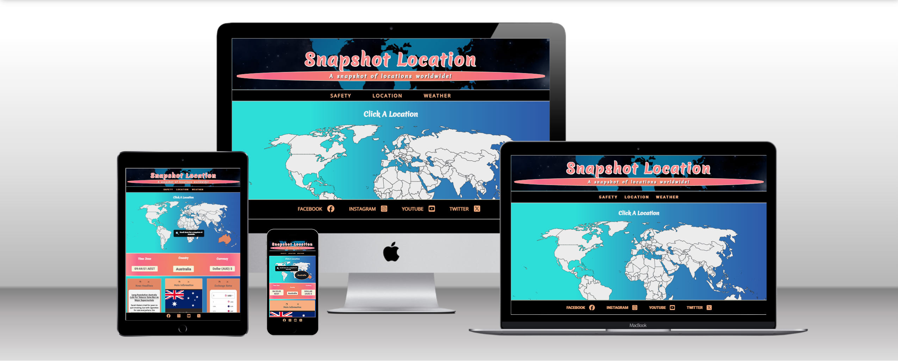</h3>

Snapshot Location is your go-to website for discovering more about a particular location.

From keen traveler looking for their next holiday destination to young schoolchild wanting to broaden their knowledge of different countries and their cultures, Snapshot Location is so simple and so intuitive to use, anyone anywhere can start exploring the planet.

Get started right here: ([Snapshot Location](https://snapshot-location-project.pages.dev/))


# Table of Contents 

## Contents

- [User Stories](#user-stories)
    - [Visitor Goals](#visitor-goals)
- [Design](#design)
  + [Colour Scheme](#colour-scheme)
  + [Typography](#typography)
  + [Imagery](#imagery)
  + [Icons](#icons)
- [Structure](#structure)
- [Irregular Structure](#irregular-structure)
- [Features](#features)
    + [Current Features](#current-features)
    + [Future Features](#future-features)
- [Wireframes](#wireframes)
- [Technologies](#technologies)
  + [Languages](#languages)
  + [Frameworks Libraries Programs](#frameworks-libraries-programs)
- [Testing](#testing)
- [Testing User Stories](#testing-user-stories)
    - [Testing Visitor Goals](#testing-visitor-goals)
- [Deployment](#deployment)
  + [Cloudfare Pages](#cloudfare-pages)
  + [GitHub Pages](#github-pages)
- [Credits](#credits)
  + [Code](#code)
  + [Media](#media)
  + [Content](#content)
  + [Acknowledgements](#acknowledgements)


# User Stories

## Visitor Goals

"**_As a user of Snapshot Location, I would like ** _______________"

:white_check_mark: *successfully implemented*

:x: *not yet implemented*

- :white_check_mark: *an interface layout that can be immediately understood, irrespective of age and nationality, without the need for complicated instructions or a key*.
- :white_check_mark: *an easy-to-navigate platform to find different locations and get a snapshot of life living there*.
- :white_check_mark: *clearly marked locations I can easily navigate and choose from*.
- :white_check_mark: *clear and relevant information provided for each location with each distinct parameter clearly marked.*.
- :white_check_mark: *the time and timezone of the location*.
- :white_check_mark:: *the name and general information about the location, such as languages spoken, the capital city, the dialling code and population size*.
- :white_check_mark: *the principal currency used in the location with exchange rates for other locations I might be traveling from*.
- :white_check_mark: *how safe or dangerous the location happens to be*.
- :white_check_mark: *places to stay in the location*.
- :white_check_mark: *places of interest in the location*.
- :white_check_mark: *a means of making an itinerary of places to stay and places to visit.*.
- :white_check_mark: *what the weather is like in the location*.
- :white_check_mark: *Easily-accessible contact information to get in touch with any questions or to place an advert*.
- :white_check_mark: *Clearly-located social media links to see what else the site has to offer me*.

- :x: *reviews for different places to stay and visit within the location*.
- :x: *a means to book places to stay and visit or tours within the location*.
- :x: *offers for deals and promotions when booking accommodation, travel or tours*.


# Design

-   ## Colour Scheme

    -   The five main colour palettes used for Snapshot Location are black, white, tan, pink and blue. These colors are supposed to imbue the site with a playful, retro and sophisticated sense of adventure.
  
  <h3 align="center">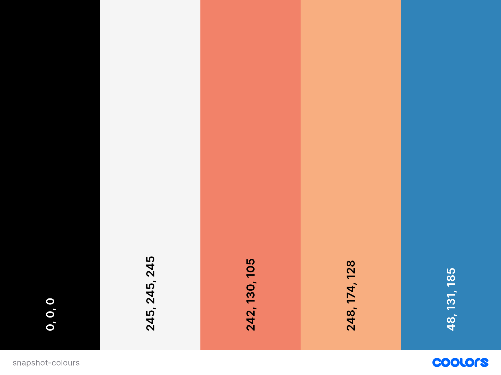</h3>
  
  
-   ## Typography

    -   I use three Google fonts throughout the website to give it that same retro and playful feel:

    1) "Merienda One"
         
         -   Merienda One is used for the logo, name and general branding, including all major headings, branching down from top to bottom.
        
        <h3 align="center"></h3>

    2)  "Open Sans"

         -   Open Sans is used for the main body of the website, so as to make reading as easy as possible for the user.
        
        <h3 align="center"></h3>

    3) "Roboto"

         -    Roboto is used for the hotels and places of interest tables, so that even on smaller screens, the results really stand out.

        <h3 align="center"></h3>

         
    -   ## Imagery

        -   Most of the imagery is self-explanatory and interactive for the user:

        ### 3 Maps

        
        #### Map 1 - Header Background Image
        
        The first map is just a background image for the header, slightly blurred so as to emphasize the header branding.
        
        #### Map 2 - Black & White Clickable SVG Map
        
        The second map is a black and white SVG image of the world with all the countries filling with a 'burnt sienna' shade of brown on user hover and click.

        <h3 align="center">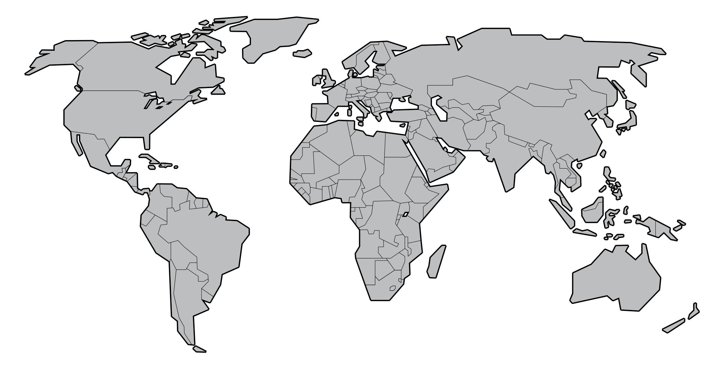</h3>
        
        #### Map 3 - OpenStreetMap Map + Emoji Icons
        
        The third map is a plain OpenStreetMap which I have found no need to cover with any filter, as I believe it suits the rest of the page fairly well. This map is imbued with a hotel emoji for each hotel result on first load, and then features amenity emojis on each amenity button click.

        ## Icons


        ### Emoji Icons


        #### Hotel Emojis 🏨
        
        On address input in the search bar above the map, the map and a table within the 'Hotels' container (HTML #hotel-container) are both populated with hotels. Each hotel on the map is sign-posted with the classic hotel emoji: "🏨".

        #### Amenity Emojis 🌳

        On amenity button click, the map and a table within the 'Places of Interest' container (HTML #place-container) are both populated with amenities. Each amenity has a corresponding emoji, as per the key below:

        museum: "🏺", landmark: "🏛️", park: "🌳", place_of_worship: "⛪", cafe: "☕", fast_food: "🥡", restaurant: "🍽️", pub: "🍻",
        bar: "🍸", nightclub: "🎶", cinema: "🎬", theatre: "🎭", arts_centre: "🖼️", events_venue: "🎙️",
        bank: "🏦", atm: "🏧", bureau_de_change: "💷", casino: "🎲", fuel: "⛽", bicycle_rental: "🚲", parking: "🅿️", car_rental: "🚘", taxi: "🚖",
        police: "🚔", pharmacy: "💊", clinic: "🩺", hospital: "🏥", dentist: "🦷",
        marketplace: "🛒", school: "🏫", university: "🎓", post_office: "🏣", recycling: "♻️",

        #### Pin Emoji 📌

        When clicking on a hotel or amenity on the map, a popup marker will display with relevant information (icon, name, address, phone number & website). At the bottom, the user will find a pin button, entailing them to pin the respective hotel or amenity to the map, while they look at other potential places of interest.

        <h3 align="center">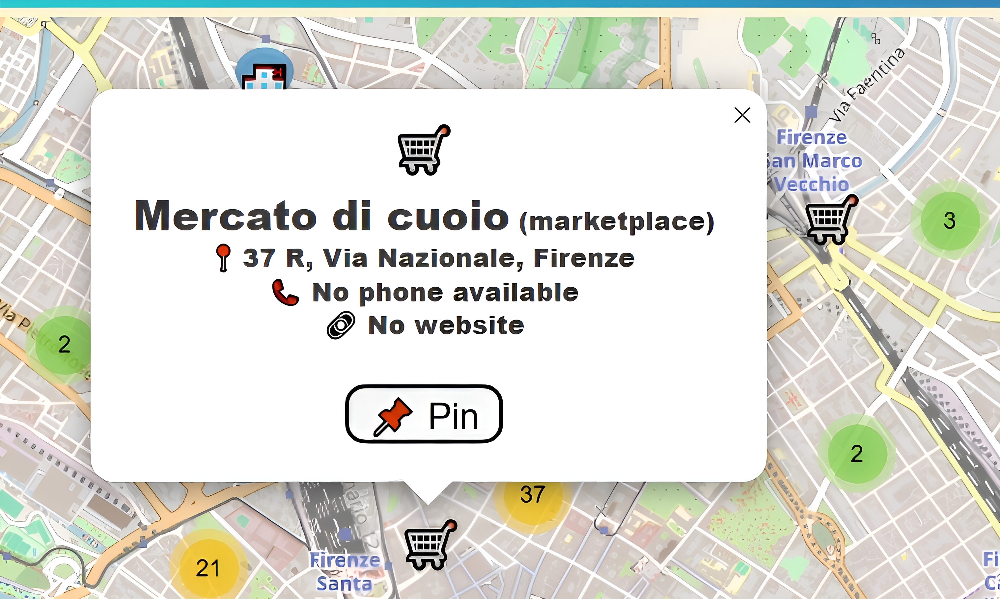</h3>

        #### Map Emoji 🗺️

        Among the information populated in the table results for both hotels and amenities, the user will find a map emoji. On clicking this map emoji, the map itself will zoom in on the respective amenity or hotel.

        <h3 align="center">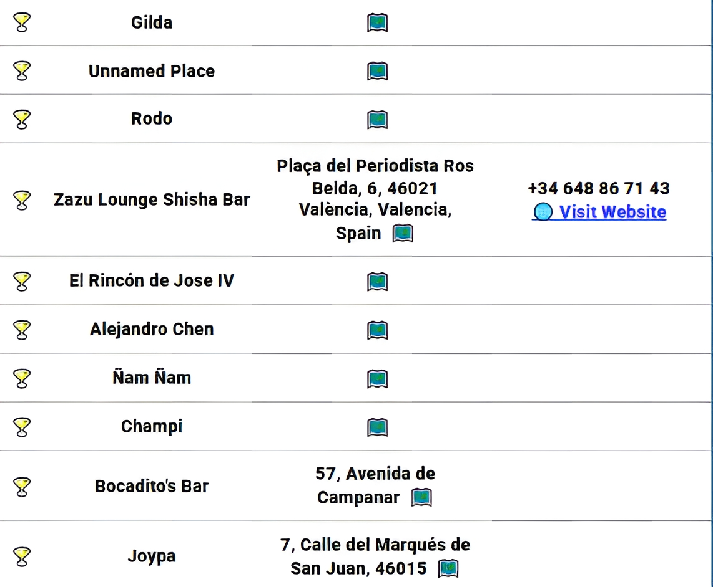</h3>


        ## Font Awesome Icons
        
        I used icons from Font Awesome for social media links in the footer, to improve clarity and efficiency for my users.


# Structure

The website has 3 pages:

## 1) *Homepage aka Location*

The Home & Landing page features 2 interactive maps and a photo carousel separating the two:

### Top Half
        
### Map 1 - Countries

The SVG Map of the world features clickable countries, the names of which appear when the user hovers over that region of the globe.

<h3 align="center">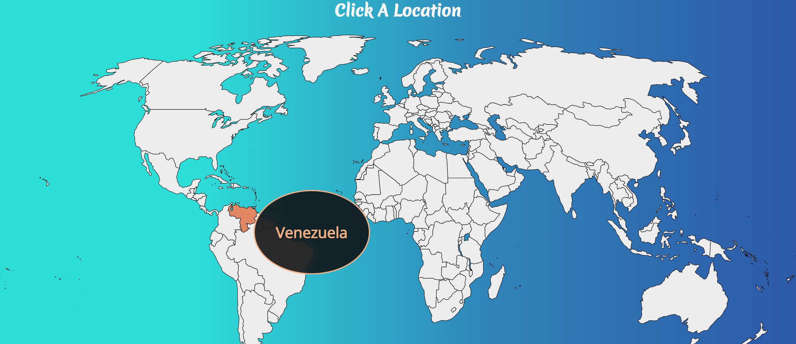</h3>

When the user clicks on any country, the following information fades in below:
 
-   i) Country Time & Timezone
        
-   ii) Country Name
        
-   iii) Country Currency

<h3 align="center">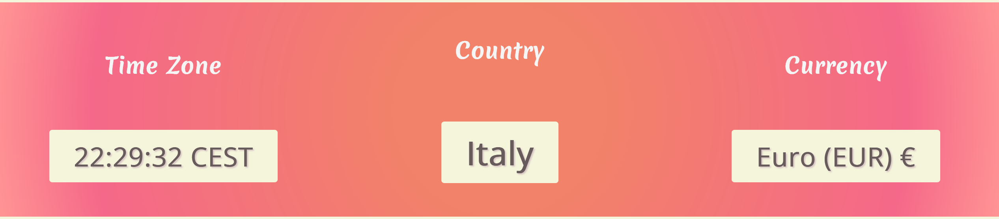</h3>

-   iv) News Headlines

-   v) Country Information

-   vi) Exchange Rates

<h3 align="center"></h3>

### Pexels Photo Carousel for Countries

The photo carousel separates the top half and the bottom half of the page, displaying photos of the country that the user has clicked in a striking carousel.

<h3 align="center">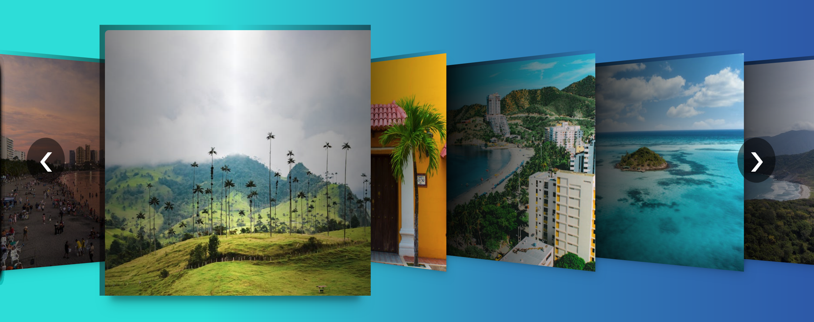</h3>

    
### Bottom Half

### Map 2 - Cities / Addresses

The OpenStreetMaps Map of the world features a search bar just above, where the user can input an address or city name. On clicking enter:
        
#### 1) The map will zoom into that address.

<h3 align="center">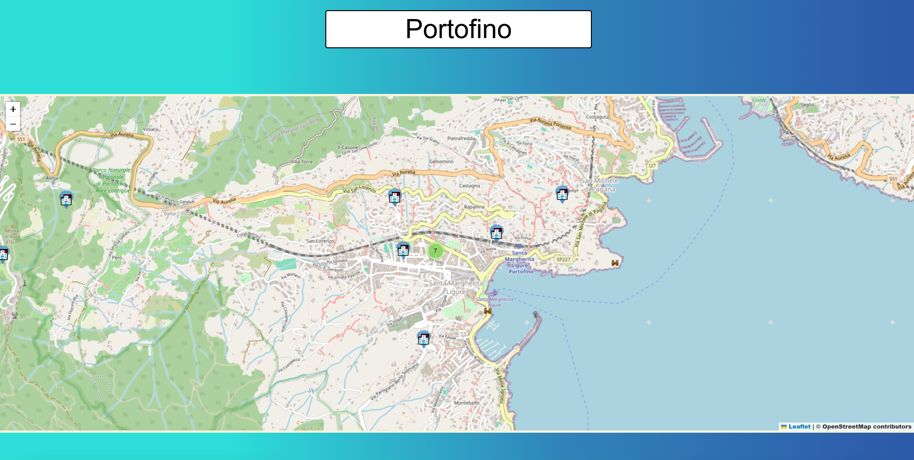</h3>
        
#### 2) The map will populate itself with hotels.

#### 3) The following information fades in below the map:
        
-   i) Hotel Details
        
-   ii) Places of Interest
        
-   iii) Weather Forecasts (Daily, 5 day & 16 day)

<h3 align="center">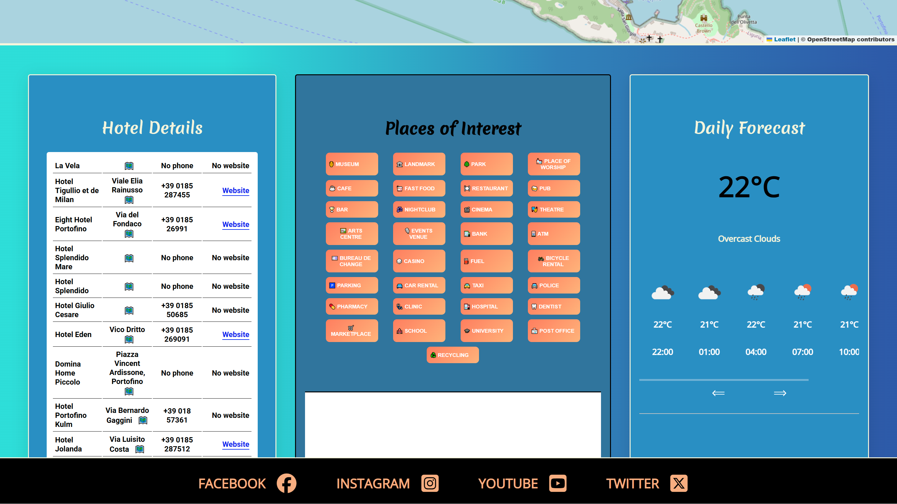</h3>

#### 4) If you click on the map emoji for one of the hotels populated in the table, the actual map will zoom in on the hotel in question.

<h3 align="center">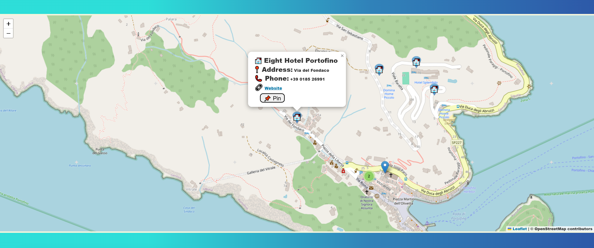</h3>

#### 5) There is then the option to choose from different amenity buttons within the place-container besides the hotel container.

<h3 align="center">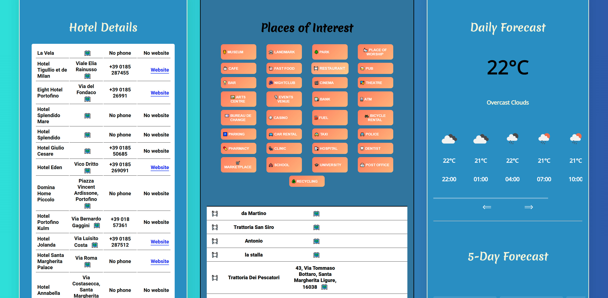</h3>
    
#### 6) Click on any amenity button and the map will be populated with markers for any found addresses appertaining to that amenity.

<h3 align="center">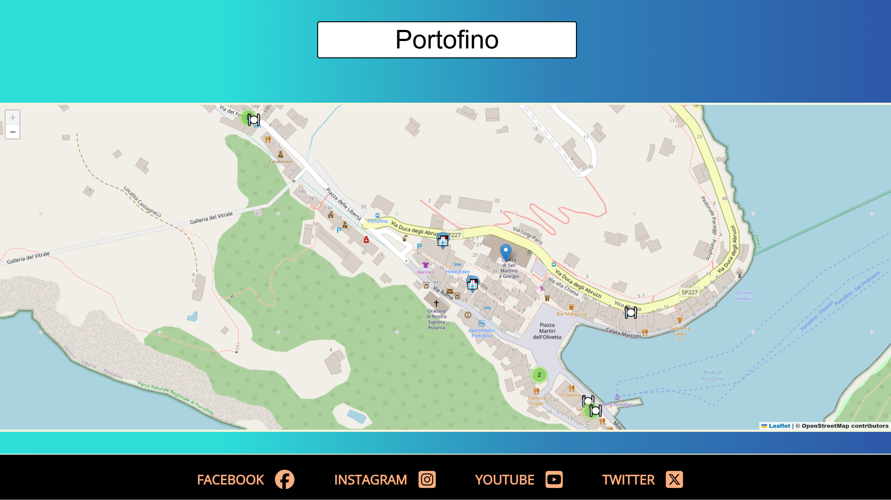</h3>

#### 7) To the right of the place-container, the user will find the weather forecasts for the address they have entered.

*   The daily forecast sits at the top and gives the next fifteen hours of weather in 3 hour increments. 
*   The five day forecast comes next and once again can be assessed in 3 hour increments. 
*   The 16 day forecast just gives a daily average for each day.

<h3 align="center">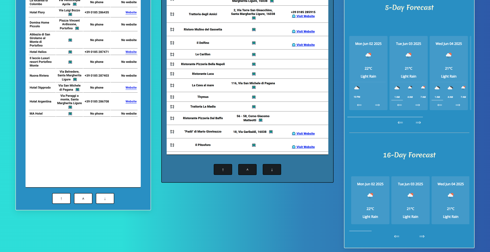</h3>

## 2) *Safety Page*

The safety page features a safety map as provided by [International SOS](https://www.internationalsos.com/risk-outlook).

## 3) *Weather Page*

The weather page features a weather map as provided by [World Weather Online](https://map.worldweatheronline.com/).

# Irregular Structure


## Embedded CSS

I have kept the css styling inline for:
        
* The wise fx currency widget came with its own inline styling, which I have preserved, also adding lazy loading and a referrerpolicy to further improve the website's best practices.

## Embedded Javascript

I have kept the javascript functions inline for:
        
* The PEXELS picture carousel.

* The postcode-link modal.

The functionality of both seem to work much more efficiently that way. At some point, I will try to deduce why. More on both in the Bugs section below.


# Features

## Current Features:

-   A nav bar, enabling the user to easily navigate from safety map to  weather map to homepage.
-   A clickable SVG map with interactive country tiles that fill with colour on hover and generate information on click.
-   A name modal that pops up on hover and fades out on scroll down.
-   A black instruction modal that pops up on map click, informing the user to 'Scroll down for a snapshot of {location}', and fades out on scroll down.
-   Fade in containers which only appear once the user has clicked a country.
-   The name of each country.
-   The time and timezone for each country.
-   The currency of each country.
-   News headlines for each country.
-   General Information for each country.
-   Exchange rates for each country.
-   A photo carousel, displaying images of each country.
-   A map & search bar.
-   Fade in containers which only appear once the user has entered a city name or address into the search bar.
-   A list of hotels and their details for the entered city or address.
-   Amenity buttons, which can generate lists of different amenities within that city or address region.
-   A weather forecast (daily, 5 day and 16 day) for the entered city or address region.
-   An interactive contact section with links to click in order to email or telephone us for more information or to ost an advert. 
-   A map modal which pops up when they click on the postcode for our company.
-   A global safety map.
-   A global weather map.
-   Responsive on all device sizes.
-   Content-packed pages, full of colourful and engaging imagery and media.
-   Interactive elements such as:
    -   Clickable maps 
    -   Scroll buttons to navigate news headlines and amenity / hotel lists
    -   Scroll arrows to navigate weather forecasts
    -   Search bars with map zoom  
    -   An interactive exchange rate widget
-   Easy offsite navigation to social media accounts.
-   A 404 page, so users who direct to a non-existent page or resource are able to return to the main page without having to use browser navigation buttons.

  <h2 align="center">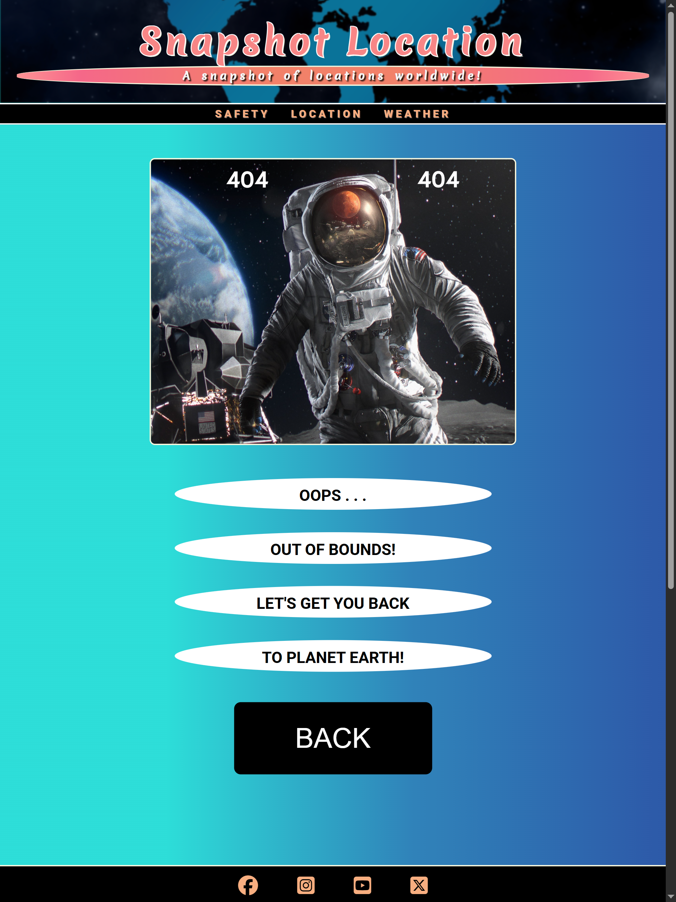</h2>

## Future Features:

-  A review container - using a Trip Advisor or Expedia API.
-  A booking container - using an Air BnB or Booking API, or, if possible, both APIs jointly.
-  A tour & events container - using APIS to list all tours or events available to the user in the entered city or address region.
-  A table generated from all the hotels and amenities the user has pinned on the map.
-  A game for children to memorize information about each country, such as capital cities, currencies etc.

# Wireframes

-   ## Homepage Wireframe - <h2 align="right">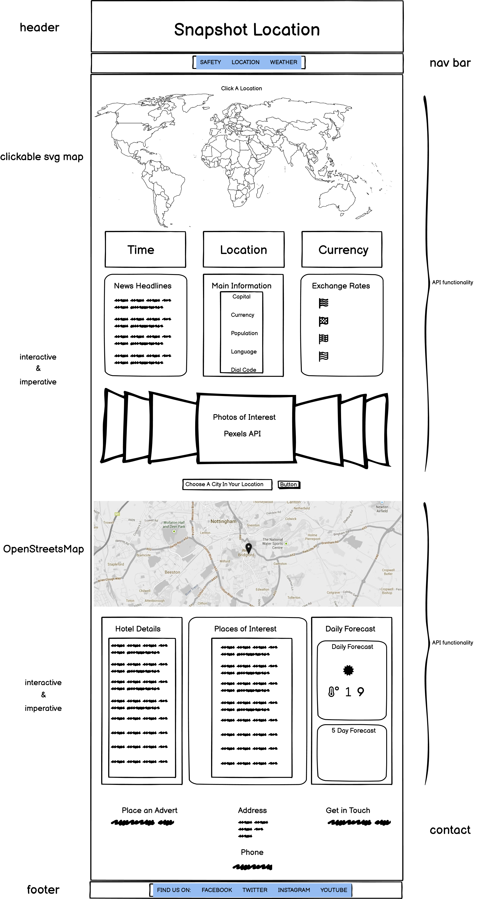</h2> 

-   ## Safety Page Wireframe - <h2 align="right">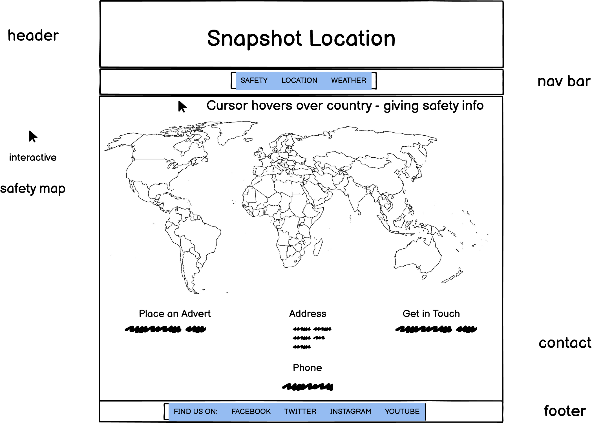</h2> 

-   ## Weather Page Wireframe - <h2 align="right">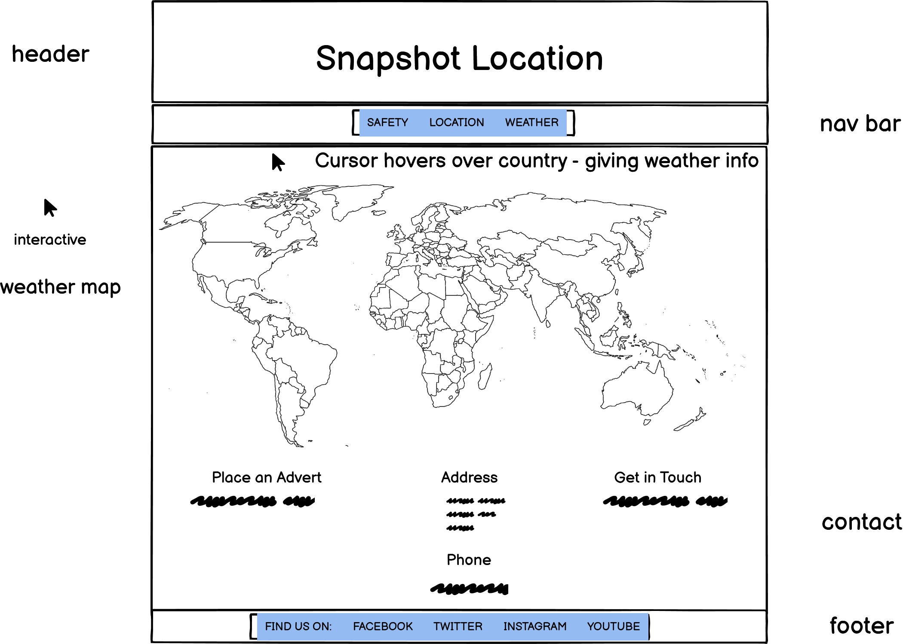</h2> 


# Technologies

-   ## Languages

-   [HTML5](https://en.wikipedia.org/wiki/HTML5)
-   [CSS3](https://en.wikipedia.org/wiki/Cascading_Style_Sheets)
-   [Javascript](https://en.wikipedia.org/wiki/JavaScript)

-   ## Frameworks Libraries Programs

1. [Hover.css:](https://ianlunn.github.io/Hover/)
    - Hover.css was used on the SVG map, social media icons in the footer and all buttons to make clear to the user that clicking would have an effect. 
2. [Google Fonts:](https://fonts.google.com/)
    - Google fonts were used to import various fonts into the style.css file, which were then used on different pages.
3. [Font Awesome:](https://fontawesome.com/)
    - Font Awesome was used on all pages throughout the website to add icons for the purpose of a more efficient UX & website aesthetics.
4. [Flexbox](https://developer.mozilla.org/en-US/docs/Learn/CSS/CSS_layout/Flexbox): 
    - Flexbox was used throughout the project to make rows and columns responsive on all devices.
5. [Media Queries](https://developer.mozilla.org/en-US/docs/Learn/CSS/CSS_layout/Media_queries): 
    - Media Queries was used throughout the project to make the web site responsive on all devices.
8. [Photoshop:](https://www.adobe.com/ie/products/photoshop.html)
    - Photoshop was used to paint, resize, retouch and edit images for the website.
9. [Balsamiq:](https://balsamiq.com/)
    - Balsamiq was used to create the [wireframes](https://github.com/) during the design process.
11. [CodeBeautify:](https://codebeautify.org/css-beautify-minify#)
    - CodeBeautify was used to help beautify the code.
13. [Coolors:](https://coolors.co/?home)
    - Coolors was used to create the colour palette for this README.
14. [Icons8:](https://icons8.com/icons/set/arrow)
    - Icons8 was used to acquire arrows for my scroll buttons and scroll arrows.
15. [Git:](https://git-scm.com/)
    - Git was used for version control by utilizing the Gitpod terminal to commit to Git and Push to GitHub.
16. [GitHub:](https://github.com/)
    - GitHub is used to store the projects code in a repository after being pushed from Git.
17. [Cloudfare:](https://dash.cloudflare.com/login)
    - Cloudfare is used to deploy the project and acquire a link.
18. [Gitpod](https://www.gitpod.io/)
    - Gitpod was used as a cloud IDE.
19. [VS Code](https://code.visualstudio.com/)
    - VS Code is always used as my local IDE.

# Testing

The Snapshot Location website has been tested using the following methods:

- [Testing](#testing)
- [Testing Functionality](#testing-functionality)
- [Code Validation](#code-validation)
    - [W3C HTML Validator](#w3c-html-validator)
        - [Homepage](#homepage)
        - [Safety](#safety-page)
        - [Weather Page](#weather-page)
    - [W3C CSS Validator](#w3c-css-validator)
    - [JSHint Javascript Validator](#jslint-js-validator)
- [Lighthouse](#lighthouse)
    - [Desktop](#desktop)
    - [Mobile](#mobile)
- [Browser Compatibility](#browser-compatibility)
- [Responsiveness](#responsiveness)
    - [Iphone](#iphone)
    - [Ipad](#ipad)
    - [Nest Hub Max](#nest-hub-max)
    - [FHD (1920x1080)](#fhd-1920x1080)
    - [2k (2560x1440)](#2k-2560x1440)
    - [4K (3840 x 2160)](#4k-3840-x-2160)
- [Manual Testing](#manual-testing)
- [Debugging](#debugging)
    - [Resolved](#resolved)    
    - [Unresolved](#unresolved)
- [Testing User Stories](#testing-user-stories)
    - [Testing Visitor Goals](#testing-visitor-goals)


## Importance of Automated & Manual Testing

### Automated

**Using automated testing to test code has several advantages over manual testing:**

* Quicker - Multiple tests can be run on the same piece of code concurrently, and in a short space of time.

* More Holistic - The ability to very quickly establish how the site will perform as a whole.

* More Exact - The ability to find more bugs, including unknown bugs.

* More Accurate - Less room for human error -- tests are only as good as the tester(s), and can therefore end up being purely decorative.

* More Honest - Less prone to manipulation or corruption.

### Manual

**Using manual testing to test code has several advantages over automated testing:**

* More Precise - No waiting for other tests to finish - one specific piece can be perfected.

* More Initiative - Tests can be written while programming, so that errors can be picked up as early as possible during development.

* More Adaptive / Flexible - Tests can remain within our code for the future (*regressive testing*), so that if ever future developments conflict with our current functionality, the programmer can be alerted with immediate effect.

* More Organic - Automated tests don't test the User Experience beyond the performative, so manual testing is essential to get a full understanding of the user experience (UX).

# Testing Functionality

The W3C Markup Validator and W3C CSS Validator Services were used to validate every page of the project to ensure there were no syntax errors in the project.

-   [W3C Markup Validator](https://validator.w3.org/#validate_by_input)
-   [W3C CSS Validator](https://jigsaw.w3.org/css-validator/#validate_by_input)
   

## Code Validation

## W3C HTML Validator

The Snapshot Location website passed all tests using the W3C HTML Validator tool

-   ### Homepage / Location

<h2 align="right">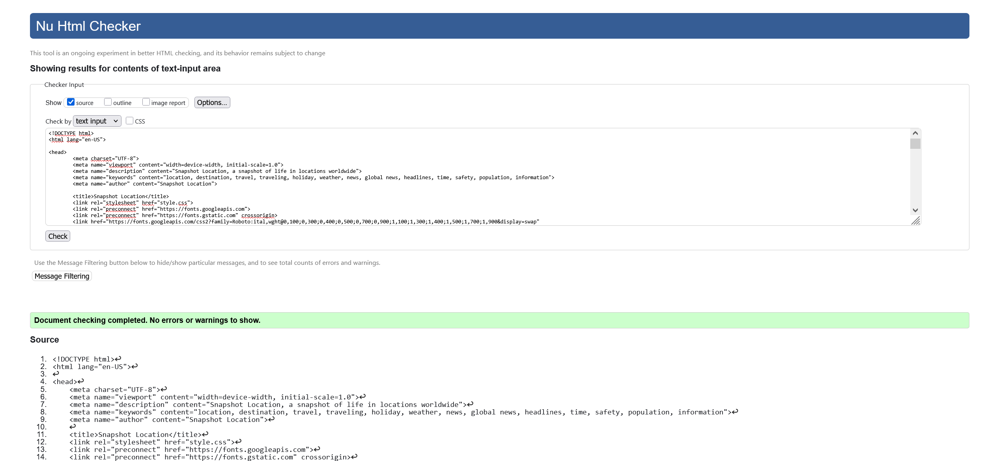</h2> 

-   ### Safety Page 

<h2 align="right"></h2> 

-   ### Weather Page 

<h2 align="right">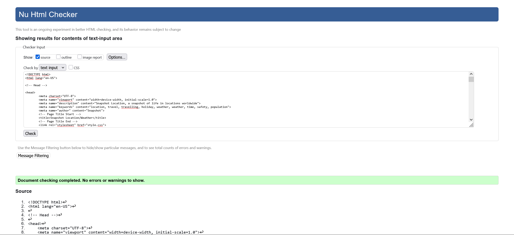</h2> 


## W3C CSS Validator

The Snapshot Location website passed all tests using the W3C CSS Validator tool
<h2 align="center">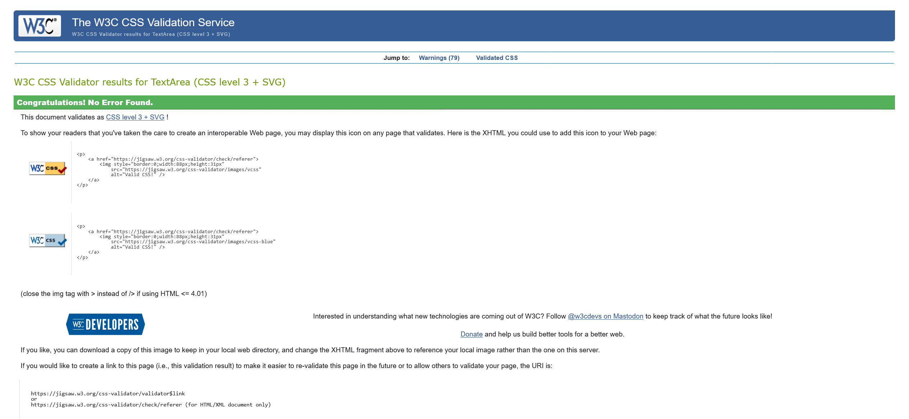</h2>


## JSHint Javascript Validator

The Snapshot Location website passed all tests using the JSHint JS Validator, with only warnings and no errors reported.

<h2 align="center">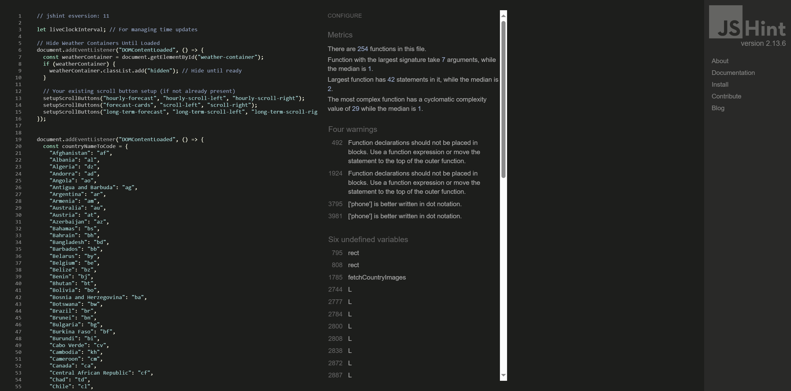</h2>

## Lighthouse

I used the Lighthouse reports in Google Developer Tools to examine the pages of the website for the following:

- Performance
- Accessibility
- Best Practices 
- SEO

### Desktop:

Homepage scored:
- Performance - 98
- Accessibility - 100
- Best Practices - 100
- SEO - 100

### Lighthouse Report for Homepage (Desktop)
    
<h2 align="center">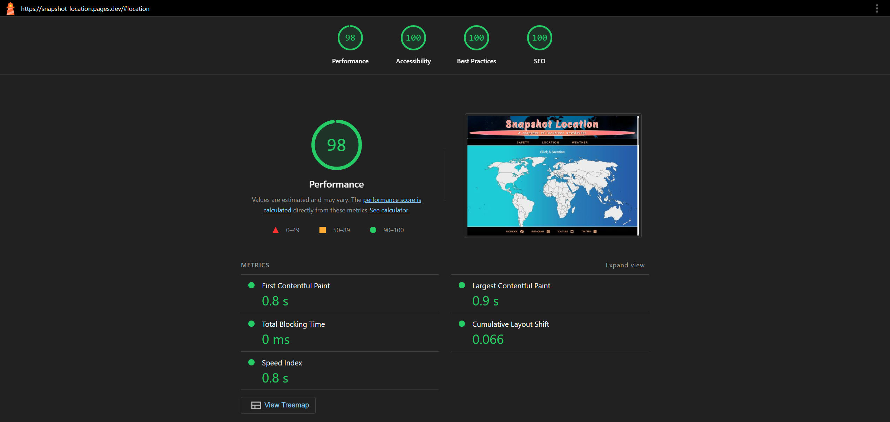</h2>

### Mobile:

Homepage scored:
- Performance - 81
- Accessibility -98
- Best Practices -75
- SEO - 100

### Lighthouse Report for Homepage (Mobile)
    
<h2 align="center">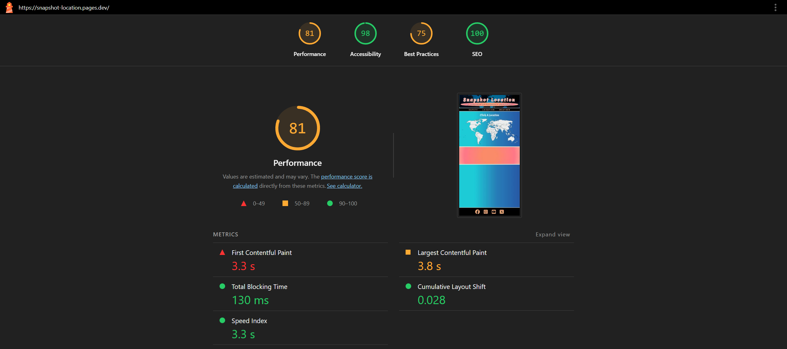</h2>

I didn't use Lighthouse for the other pages, i.e. Safety & Weather, on account of the third party scripts attached to those maps which I cannot change unless I approach their respective developers. (*Please see below for future improvements.*)

I have improved the header, navbar, contact section and footer to the best of my abilities for all pages.

Overall, I am happy with the speed the site runs on every device I've tried (various laptops, desktops, tablets and mobile phones). The pages load fast and all the functions run smoothly.

I am also more inclined to develop an app for tablets and mobile devices.

## Future Improvements

### Desktop Improvements

#### Safety & Weather Pages
  
-  I will work to improve the Safety & Weather pages by implementing better practices, such as lazy loading and referrerpolicy, and by better integrating third party cookies and functions. I will know more after I have spoken to the developers.

### Mobile Improvements
  
#### Homepage
  
- The Homepage ***Performance*** score could be improved by decreasing the *Largest contentful paint element*.

- The Homepage ***Best Practices*** score could be improved by better integrating the wise widget and its trackers and third party cookies.

#### Safety & Weather Pages
  
-  I will work to improve the Safety & Weather pages by implementing better practices, such as lazy loading and referrerpolicy, and by better integrating third party cookies and functions. 
   
## Browser Compatibility

The site was tested in Brave, Google Chrome, Microsoft Edge and Mozilla Firefox on Desktop.

The site was tested in Brave, Google Chrome and Firefox on Mobile and Tablet.

No issues arose during browser testing. 

Appearance, functionality and responsiveness were largely consistent across browsers and devices, adapting fluidly when changing from portrait to landscape mode.

## Responsiveness

Responsiveness tests were carried out using Google Chrome DevTools & Microsoft Edge DevTools. Device screen sizes covered include:

- iPhone SE
- iPhone XR
- iPhone 12 Pro
- Pixel 5
- Samsung Galaxy S8+
- Samsung Galaxy S20 Ultra
- iPad Mini
- iPad Air
- Surface Pro 7
- Surface Duo
- Galaxy Fold
- Samsung Galaxy A51/71
- Nest Hub
- Nest Hub Max

### Iphone 
<h2 align="center">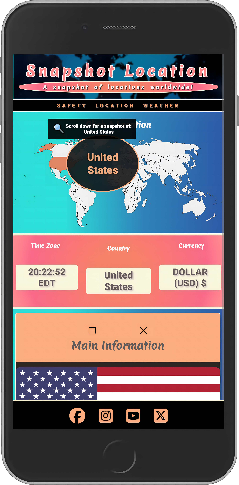</h2>

### Ipad 
<h2 align="center">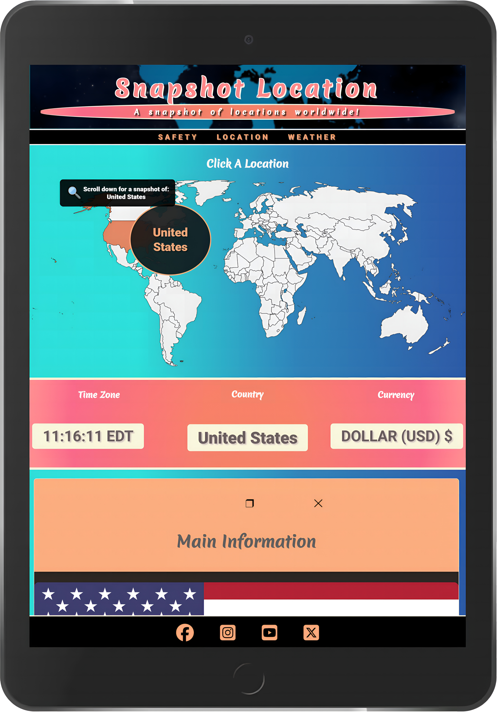</h2>

### Nest Hub Max 
<h2 align="center">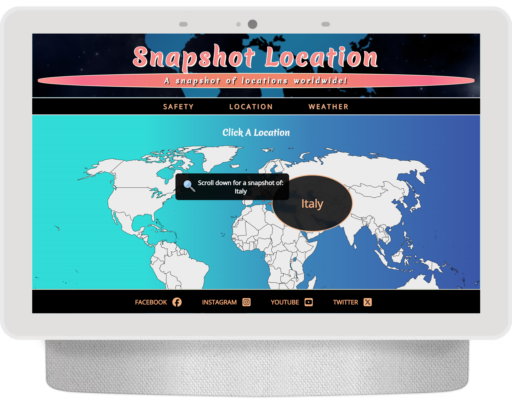</h2>

I also created custom settings for FHD (1920x1080), 2k (2560x1440) & 4K (3840 x 2160) screens to verify the web pages would work across monitor sizes. 

### FHD (1920x1080) 
<h2 align="center">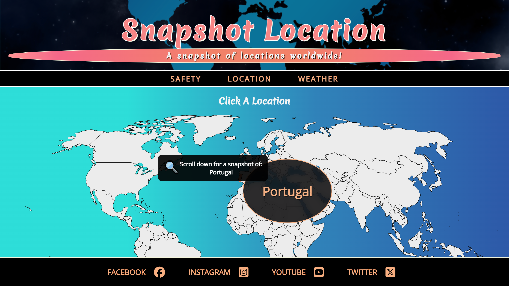</h2>

### 2k (2560x1440)
<h2 align="center">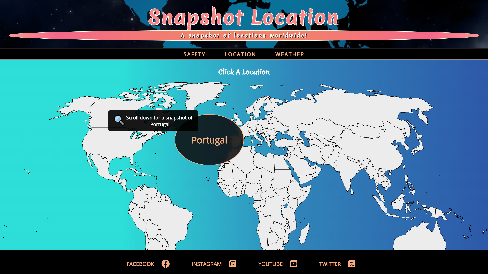</h2>

### 4K (3840 x 2160)
<h2 align="center">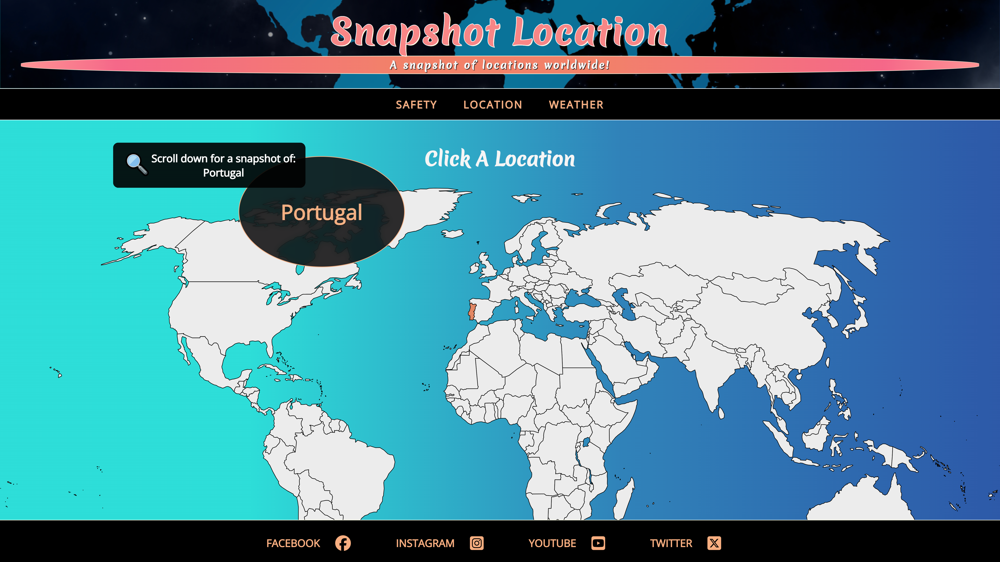</h2>

# Manual Testing 

## Manual Testing (Console)

In order to ensure that my javascript was working correctly, I would add manual tests throughout my script, and then check them in console. In certain situations, where I felt regressive testing might be useful later, I left them in place. Please see the two examples below:

### Testing for API Fetch Functionality

Test if API fetch functionality is working correctly.

- Run this in the browser console (F12 → Console tab):


console.log(`✅ You have ${window.fetch ? "active API calls using fetch" : "no fetch API calls detected"}`);

- Result:

<h3 align="center">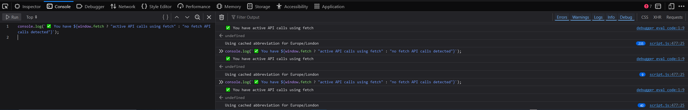</h3>

### Testing for Specific HTML Elements:

Test if hotel and amenity tables exist.

- Run this in the browser console (F12 → Console tab): 

```javascript
const hotelTable = document.getElementById("hotel-results");
const placesTable = document.getElementById("places-results");

console.log("🏨 Hotel table exists:", !!hotelTable);
console.log("📍 Amenity table exists:", !!placesTable);
```

- Result:

<h3 align="center">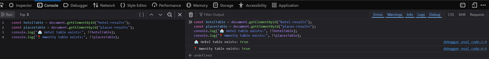</h3>

## Manual Testing (BDD)

Behaviour-Driven Development is based on  the expected outcome of an action, to see if an app behaves as expected. BDD builds on the user stories, extending this by adding Given, Then, and When  - so given (a specific context), when (a specific action is carried out), then (a particular set of observable consequences should occur). The behaviour is now testable and repeatable.
 
### BDD - Snapshot Location

As a user, when I arrive at the webpage. 
- I want to be able to hover over each country, so that each country tile displays the name of the country.
- When I click on the country, I want to know that my clicking the country has had an impact.
- When I scroll down, I want to find all the information about the clicked country waiting for me.
- When I enter a city name or address into the search bar, I want the map to zoom in on that city or address.
- If I enter an incorrect result, I want to be notified that I have made a mistake.
- When I click on a map in the table of hotel and place results, I want the map to zoom in on that hotel or place.
- When I click on an amenity button, I want those amenities populated on the map.

## Debugging
    
### Resolved

1. Not technically a bug, but the biggest obstacle I faced to developing this site was the monthly charge I kept incurring for using Google Cloud Services: 
    -   I signed up for a free trial ($300 credit included) and was extremely diligent about checking my daily spend, to ensure I hadn't surpassed my credit limit. Unfortunately the billing amount you see listed is backdated by one day. As I saw the forecasted total bill for the month as £0, I carried on using the services in a dev capacity for the last day of the month, probably doing a further 10-15 city searches. 
    -   To my horror, two days later I received a bill for £1800. This was owing to my not having restricted which APIs were being triggered during searches and having not set quotas around my potential budget. 
    -   I would recommend any other devs signing up for Google Cloud Services ensure that they i) have restricted which APIs / SKUs they are using and ii) set quota limits for each day. 
    -   I would also recommend that Google Cloud Services create a much more transparent and intuitive landing page and guide, so that other students and developers do not fall into the same trap I did.
    -   Fortunately, the Google Cloud Services representatives are really kind and really helpful, so they guided me through how to set quotas and restrict APIS and waived my first bill as a goodwill gesture. Hence my thanks to them later in this README.
    -   Setting my API key to Maps Javascript API & Places API only and restricting the daily quota fixed my problem, but even doing five plus city searches per day with those checks in place would have proved prohibitively expensive.
    
    -   I ultimately solved this problem by using OpenStreetMaps, Leaflet, Nominatim and Overpass.

2. My #name modal, which appears above a country when the user hovers above it, caused me the following problem:

    -   It would either disappear off the screen or expand the viewport beyond my body width for countries to the far right of the map.

    -   This was fixed by using a resizeModalByScreen() function and then using modal.style.transform to scale the size of the modal on each screen:

    ```javascript
	**// Scale based on screen width
	if (width >= 3300) {
		modal.style.transform = "scale(2.5)";
	} else if (width >= 2600) {
		modal.style.transform = "scale(1.8)";
    ...
	} else {
		modal.style.transform = "scale(1)";
	}**

3. My PEXELS Image Carousel would only take up part of the screen. 

    -   I solved this by cloning the first and last slides as below to create a lopping effect:

    ```javascript
    // Clone first and last slides for seamless looping effect
    const firstClone = carouselContainer.firstElementChild.cloneNode(true);
    const lastClone = carouselContainer.lastElementChild.cloneNode(true);
    carouselContainer.appendChild(firstClone);
    carouselContainer.insertBefore(lastClone, carouselContainer.firstChild);

4. At first, three of my amenity buttons (park, landmark and museum) would not fetch and display the places of interest assigned to them. I came to realize that all three are not listed as amenities, but as tourism nodes:

    ```javascript
    let queryType;

    switch (type) {
        case "museum":
            queryType = `
                (
                    node["tourism"="museum"](around:5000,${lat},${lng});
                    way["tourism"="museum"](around:5000,${lat},${lng});
                    relation["tourism"="museum"](around:5000,${lat},${lng});
                );`;
            break;
        case "park":
            queryType = `
                (
                    node["leisure"="park"](around:5000,${lat},${lng});
                    way["leisure"="park"](around:5000,${lat},${lng});
                    relation["leisure"="park"](around:5000,${lat},${lng});
                );`;
            break;
        case "landmark":
            queryType = `
                (
                    node["tourism"="attraction"](around:5000,${lat},${lng});
                    way["tourism"="attraction"](around:5000,${lat},${lng});
                    node["historic"](around:5000,${lat},${lng});
                    way["historic"](around:5000,${lat},${lng});
                    relation["historic"](around:5000,${lat},${lng});
                );`;
            break;
        default:
            queryType = `node["amenity"="${type}"](around:5000,${lat},${lng});`;
            break;
    }
    ```

5. My favicon kept triggering an error message on all browsers when I used the standard:

    ```html
    <link rel="icon" href="/favicon.ico" type="image/x-icon" sizes="any">
    ```

    So, I used the backup workaround instead, replacing the `.ico` image with a `.png` image instead:


    ```html
    <link rel="icon" type="image/png" href="/favicon-32x32.png" sizes="32x32">
    ```

    This solved my problem.

### Unresolved

1.  ####  Limited SVG Map

I have used the free SVG World Map download from Simple Maps (https://simplemaps.com/world). Neither China nor the United States are included unless you buy the fully licensed version for $199. I will likely do this in the future. Until then, China will appear as Taiwan and the United States as the United States Minor Outlying Islands.

2.   #### Quota Errors

As I am using many API services on their free pricing model during the development stage, occasionally the user will experience errors such as the following:

<h3 align="center">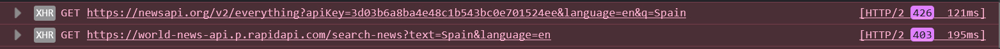</h3>

-   400 Bad Request 
-   403 Forbidden
-   426 Upgrade Required

    or the likes of


GET https://gtm.wise.com/anon-get?eventName=fx-embed-load&origin=https://snapshot-location.pages.dev/ NS_BINDING_ABORTED

which is an analytics call trying to send data back to Wise’s servers, informing them which site is using their widget.

3.  #### OpenStreetMaps Map Occasionally Needs Reloading Before A New Search


After looking up one city, it is not advised to put another city into the search bar before reloading the page. 

I believe this is owing to the fact I have prohibited people using the search bar and map before clicking on a country.

This should be fixed in an upcoming version.


# Testing User Stories

## Testing Visitor Goals

### ✅ As a user of Snapshot Location, I would like an interface layout that can be immediately understood, irrespective of age and nationality, without the need for complicated instructions or a key.

**Implemented with:**
- Clean layout with instructions and intuitive UI. 
- A clickable SVG map with hover states for different countries.
- Black modal with instructions that appears on map click and fades on scroll down.  

<h3 align="center">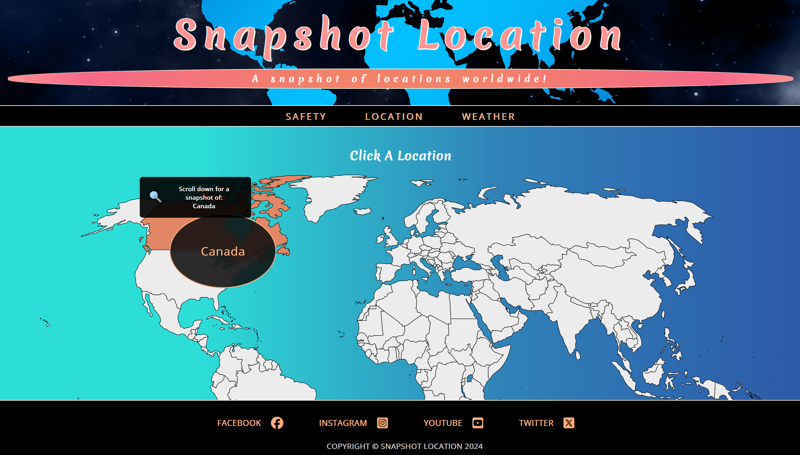</h3>

---

### ✅ As a user of Snapshot Location, I would like an easy-to-navigate platform to find different locations and get a snapshot of life living there.

**Implemented with:**
- Navbar with links to homepage, weather page, and safety page 
- Interactive SVG map and map search bar  
- Country information containers fade in dynamically after user clicks a country

<h3 align="center">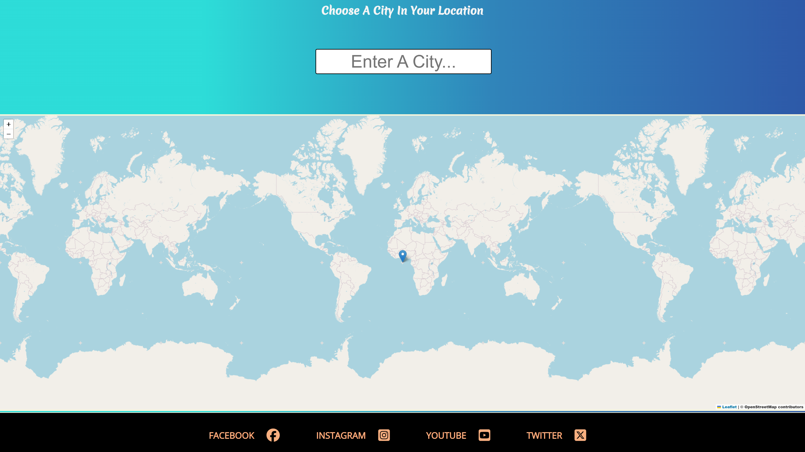</h3>

---

### ✅ As a user of Snapshot Location, I would like clearly marked locations I can easily navigate and choose from.

**Implemented with:**
- Country name modals  
- Search bar with map zoom on input

---

### ✅ As a user of Snapshot Location, I would like clear and relevant information provided for each location with each distinct parameter clearly marked.

**Implemented with:**
- Country name, general info and currency containers
- Weather forecasts
- Photo carousel  
- Hotels and amenities markers and tables

<h3 align="center">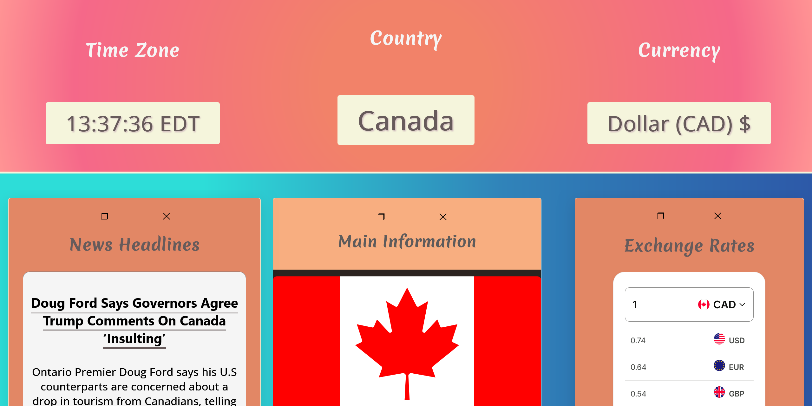</h3>

---

### ✅ As a user of Snapshot Location, I would like the time and timezone of the location.

**Implemented with:**
- Time & Timezone Box

---

### ✅ As a user of Snapshot Location, I would like the name and general information about the location, such as languages spoken, the capital city, the dialling code and population size.

**Implemented with:**
- Name Box
- A General Information panel for every country including key stats  

---

### ✅ As a user of Snapshot Location, I would like the principal currency used in the location with exchange rates for other locations I might be traveling from.

**Implemented with:**
- Country Currency Box 
- Interactive exchange rate widget  

---

### ✅ As a user of Snapshot Location, I would like to know how safe or dangerous the location happens to be.

**Implemented with:**
- Global safety map featuring heatmaps for different levels of danger 
- Safety index information for each country  

<h3 align="center">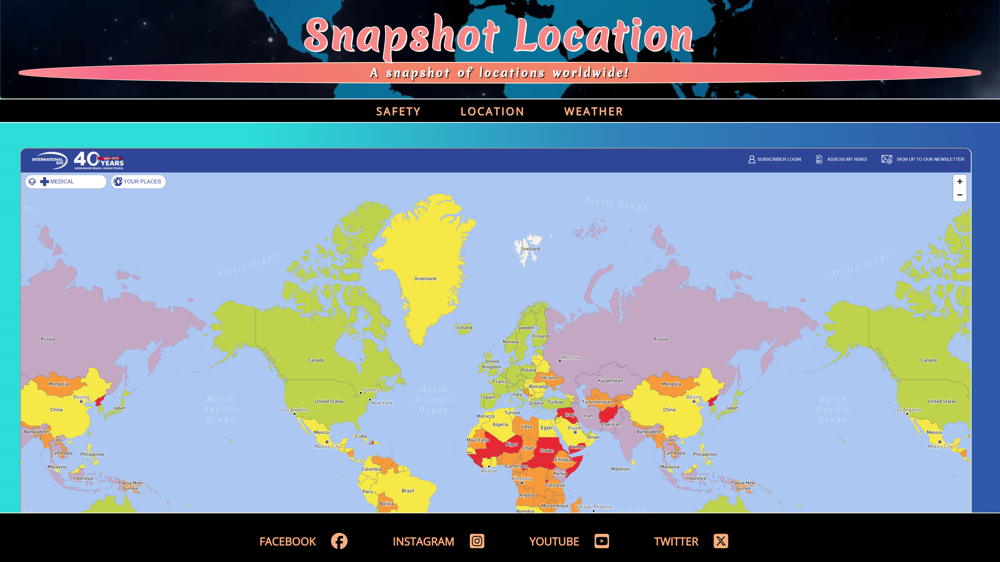</h3>

---

### ✅ As a user of Snapshot Location, I would like places to stay in the location.

**Implemented with:**
- A search bar generating hotel markers on the map
- A search bar generating scrollable lists of results  

<h3 align="center">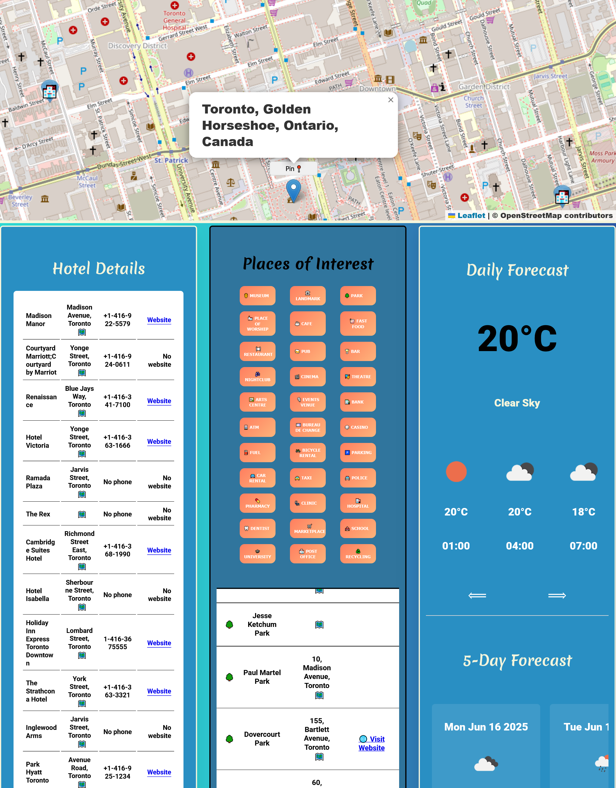</h3>

---

### ✅ As a user of Snapshot Location, I would like places of interest in the location.

**Implemented with:**
- Amenity buttons for tourist attractions, museums, cafés, etc.  
- Interactive amenity markers on map with info popups

<h3 align="center">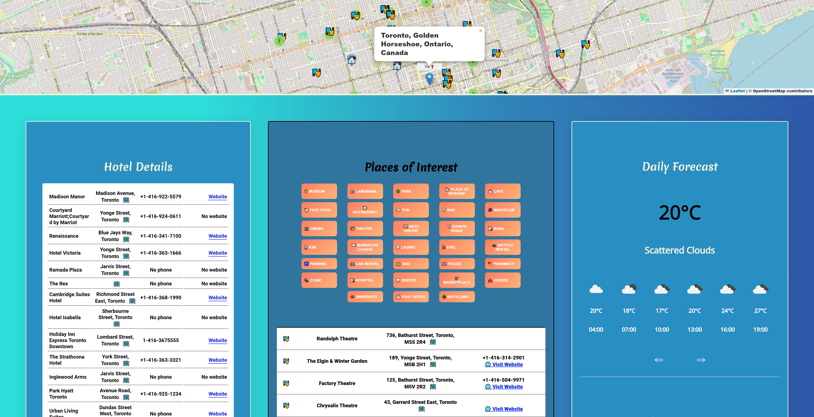</h3>

---

### ✅ As a user of Snapshot Location, I would like a means of making an itinerary of places to stay and places to visit.

**Implemented with:**
- Tables of amenity and hotel results
- Map emoji & map marker sync
- Amenity buttons
- Pop up markers 
- Pin buttons

<h3 align="center">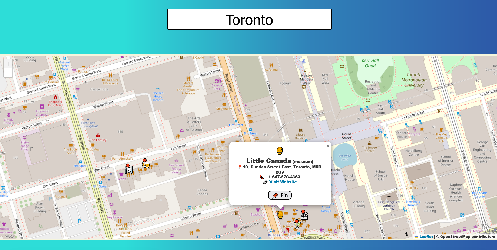</h3>

---

### ✅ As a user of Snapshot Location, I would like to know what the weather is like in the location.

**Implemented with:**
- Weather forecast widget (daily, 5-day, and 16-day)  
- Global weather map featuring heatmaps for different temperatures

<h3 align="center">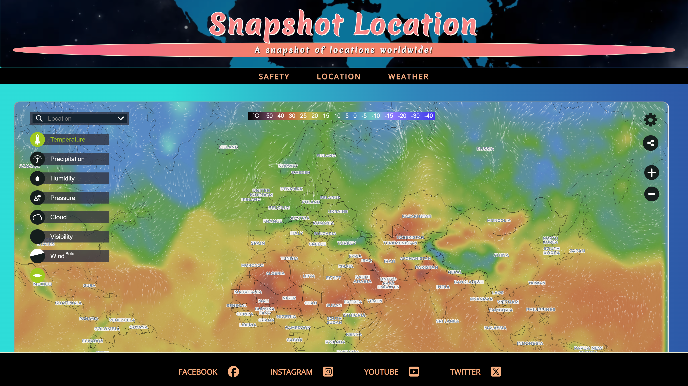</h3>

---

### ✅ As a user of Snapshot Location, I would like easily-accessible contact information to get in touch with any questions or to place an advert.

**Implemented with:**
- Interactive contact form with mail and phone buttons  
- Map modal with clickable postcode and directions  

<h3 align="center">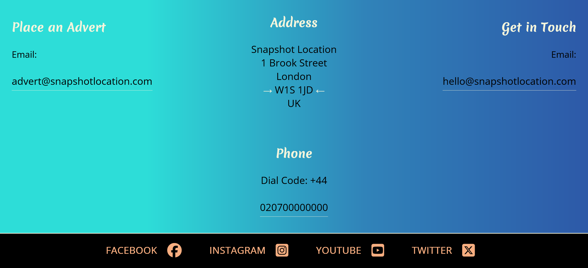</h3>

---

### ✅ As a user of Snapshot Location, I would like clearly-located social media links to see what else the site has to offer me.

**Implemented with:**
- Footer and contact section with external links to social media platforms  

---

### ❌ As a user of Snapshot Location, I would like reviews for different places to stay and visit within the location.

*Not yet implemented*

---

### ❌ As a user of Snapshot Location, I would like a means to book places to stay and visit or tours within the location.

*Not yet implemented*

---

### ❌ As a user of Snapshot Location, I would like offers for deals and promotions when booking accommodation, travel or tours.

*Not yet implemented*

---

## Summary

🟢 **14 features implemented & tested**  
🔴 **3 features pending**


# Deployment

## Reasons for Privacy

Early into my use of APIs, I learnt the hard way about unpredictable pricing and hidden charges by accidentally racking up a bill for over £1000 with Google Cloud Services. The Google representatives kindly waived it on account of my being a confused student, but it was only the first of many issues I have encountered using APIs.

This is no complaint. I'm hugely grateful to the open-source community and all the API providers for giving me access to such fantastic tools and such a vast array of information. I still marvel at the workmanship involved and I love delving into all they have to offer.

Rather, it is background to the explanation below for keeping my repository private and for the additional commits I have had to make post hand-in:

### Privacy

1) I felt the need to keep this repository private because I only have a limited amount of hits per day/month on the free tier of these APIs. I feared keeping it open would leave room for random visitors to click away and leave no credits / hits left for my tutor, Rachel Furlong, nor the external examiners, to assess this project.

2) I also wish to use all of this free code respectfully, as the creators have asked of me.

### Extra Commits

3) The global safety API I was using stopped functioning, so I had to replace it with one provided by [Safeture Riskline](https://safeture.com/riskline-launch-apis-improvements/).

4) My openweather API student subscription ended over the weekend I was asked to make amendments. I presumed I would automatically go back to using the free tier, but that wasn't the case and my weather-forecast container broke.

5) That same weekend, NewsAPI changed its pricing model, meaning I would be entitled to less hits - this resulted in my news-headlines container crashing due to 403 errors, i.e. limits being reached. I had to incorporate other news APIS along with NewsAPI.

6) I came to realize I would have to implement caching for some of my containers, so that the site would be able to display results, even when I had gone over my free tier allotment and API providers were throttling me or returning unauthorized errors.

7) I had to introduce a proxy worker page with Cloudflare to deal with 401 and CORS errors slowing or crashing elements of my site because I wasn't properly acknowledging the API providers' request for a detailed header with my site name and email address.

There were other issues I faced, which I am happy to discuss, but I think this a long enough summation for the README.


## Cloudflare Pages

As I wanted to keep my repository private, I decided to deploy with Cloudflare Pages, as Github wouldn't allow me to keep me repository private when deploying to Github Pages, unless I purchased a pro subscription.

The project was deployed to Cloudflare Pages using the following steps...

Log into Cloudflare Pages

Go to: 
1.	Log in to [Cloudflare Pages](https://pages.cloudflare.com/)
2.	Authorize Cloudflare to access your GitHub account.
3.	Select the snapshot-location repository.
4.	Choose the main branch.
5.	When prompted:
    -	Framework preset: None
    -	Build command: (leave blank if static)
    -   Output directory: ./ or dist (if you have one).
6.  Deploy and obtain a link:

https://snapshot-location.pages.dev

Ordinarily, if I didn't want to keep my repository private, I would deploy to Github Pages, using the following protocol:

## GitHub Pages

The project was deployed to GitHub Pages using the following steps...

1. Log in to GitHub and locate the [GitHub Repository](https://github.com/).
2. At the top of the Repository (not top of page), locate the "Settings" Button on the menu.
- Alternatively Click [Here](https://raw.githubusercontent.com/) for a GIF demonstrating the process starting from Step 2.
3. Scroll down the Settings page until you locate the "GitHub Pages" Section.
4. Under "Source", click the dropdown called "None" and select "Master Branch".
5. The page will automatically refresh.
6. Scroll back down through the page to locate the now published site [link](https://github.com) in the "GitHub Pages" section.

## Forking the GitHub Repository

By forking the GitHub Repository we make a copy of the original repository on our GitHub account to view and/or make changes without affecting the original repository by using the following steps...

1. Log in to GitHub and locate the [GitHub Repository](https://github.com/).
2. At the top of the Repository (not top of page) just above the "Settings" Button on the menu, locate the "Fork" Button.
3. You should now have a copy of the original repository in your GitHub account.


# Credits

## Code

-   [Code Institute](https://codeinstitute.net/): I referred back to tutorial videos and my notes taken throughout the process of developing this website:  
    -   The foundation of all the HTML, CSS & Javascript were learnt doing the Code Institute course and respective challenges.
    -   I referred to the code from Code Institute's example projects for inspiration, before going away and sourcing more specific tutorials, such as those listed below.
    -   Code from the Love Running project formed the basis of the Media Queries css used in my website.

-   [YouTube](https://youtube.com/): I used the following tutorials to build various sections of this site and learn more about using APIs:

    *   [SVG Map + Name & Time](https://www.youtube.com/watch?v=WtoyIiOp5Aw)

    *   [Country Information from REST COUNTRIES](https://www.youtube.com/watch?v=THZyM2z8s-o)

    *   [News App](https://www.youtube.com/watch?v=ZGLKTQVyT0U)

    *   [Weather App](https://www.youtube.com/watch?v=74IOjtVvExY)

    *   [5 Day Forecast](https://www.youtube.com/watch?v=31Z0Z2Qn8NE)

    *   [OpenStreetMaps + Leaflet](https://www.youtube.com/watch?v=vOPr5k_SGVA)

    *   [Javascript Chaining](https://www.youtube.com/@SteveGriffith-Prof3ssorSt3v3/search?query=javascript%20chain): 

-   [Mozilla Developer](https://developer.mozilla.org/en-US/docs/Learn/CSS/CSS_layout/Media_queries): Mozilla Developer helped me achieve the exact level of responsiveness I wanted from Media Queries.

-   [CODECONVEY](https://codeconvey.com/pure-css-coverflow-slider/): I learnt how to create a Pure CSS 3D Coverflow Image Slider at CodeConvey.

-   [Wise](https://wise.com/gb/business-tools/fx-widget) Wise provided their own widget for the fx exchange, which I have found very easy to implement and use.

-   [Free Code Camp](https://www.freecodecamp.org/news/how-to-build-a-modal-with-javascript/): Free Code Camp gave me the knowledge to create a basic javascript modal.

-   [Stack Overflow](https://stackoverflow.com/questions/27583937/how-can-i-make-a-css-glass-blur-effect-work-for-an-overlay): Stack Overflow gave me the knowledge to create a blurred / frosted glass effect overlay.

-   [Stack Overflow](https://stackoverflow.com/questions/300220/how-to-prevent-text-in-a-table-cell-from-wrapping): Stack Overflow gave me the knowledge to prevent my table text from overflowing. 

-   [CSS-TRICKS](https://css-tricks.com/almanac/properties/t/text-underline-position/): CSS-TRICKS gave me the knowledge to set the placement of the underline so it wasn't obscuring my text in the headlines section.

-   [CSS Script](https://www.cssscript.com/drag-resize-minimize-maximize-close-interactive/): gave me the foundations for incorporating minimize and maximize buttons within a container.


## Content

-   All content was created and written by the developer.


## Media


-  All Country Information was kindly provided by REST COUNTRIES [REST COUNTRIES](https://restcountries.com/).

-  All City Information was kindly provided by [OpenStreetMap](https://www.openstreetmap.org/), [Overpass](https://wiki.openstreetmap.org/wiki/Overpass_API) [Nominatim](https://nominatim.org/) & [Leaflet](https://leafletjs.com/).

-  All hotel & amenity information was kindly provided by [OpenStreetMap](https://www.openstreetmap.org/), [Overpass](https://wiki.openstreetmap.org/wiki/Overpass_API) & [Leaflet](https://leafletjs.com/).

-   All Photos were kindly provided by [PEXELS](https://www.pexels.com/).

-   All News Stories were kindly provided by [NEWS API](https://newsapi.org/), [World News API ](https://worldnewsapi.com/), [GNews](https://gnews.io/) &[NewsData](https://newsdata.io/).

-   The currency exchange widget was kindly provided by [Wise](https://wise.com/gb/business-tools/fx-widget).

-   All Weather forecasts were kindly provided by [OpenWeather](https://openweathermap.org/api).

-   The address map in my contact section postcode modal was kindly provided by [Google Maps](https://www.google.co.uk/maps).

-   The global safety map was kindly provided by [Safeture Riskline](https://safeture.com/riskline-launch-apis-improvements/).

-   The global weather map was kindly provided by [World Weather Online](https://map.worldweatheronline.com/).


## Acknowledgements

-   Rachel Furlong, my Academic Supervisor and Lecturer, for the great lessons, inspirational pep talks, kind guidance, helpful feedback and recommended tools.

-   My mentor, Marcel Mulders, for all the kind advice, encouragement, helpful feedback and recommended tools.

-   Thank you to my fellow students for their friendly tips and guidance.

-   Thank you to the tutors and staff at Code Institute for all their support.

-   Thank you to the Code Institute Slack Community.

-   Thank you to the YouTube community.

-   Thank you to the Reddit community.

-   Thank you to all the representatives at Google Cloud Services, who very kindly walked me through their product range, guided me through restricting APIs, as well as setting quotas, and helped me with the unexpected charges. While the services proved prohibitively expensive at this stage of development, the representatives who helped me were some of the most lovely, friendly and articulate mentors I've had the pleasure of meeting.

# Root

Snapshot Location has been created as part of the developer's portfolio but will be further developed into a website in the near future.

<h4 align="center">yinyangsammy 2025</h4>