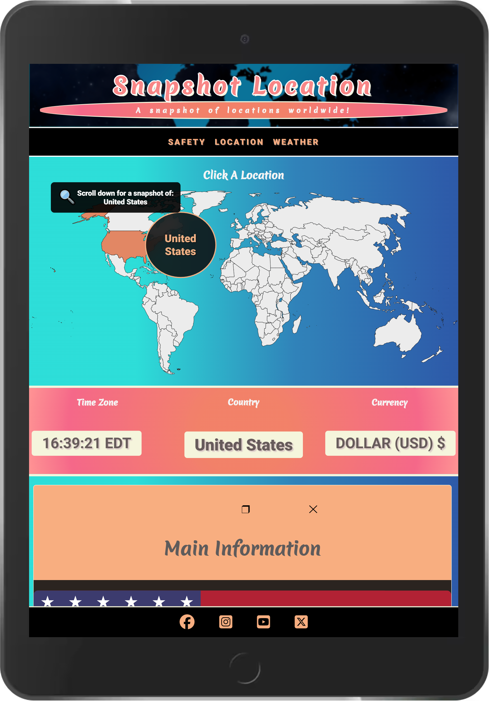

<h1 align="center" bold>Snapshot Location</h1>

<h3 align="center"></h3>

Snapshot Location is your go-to website for discovering more about a particular location.

From keen traveler looking for their next holiday destination to young schoolchild wanting to broaden their knowledge of different countries and their cultures, Snapshot Location is so simple and so intuitive to use, anyone anywhere can start exploring the planet.

Get started right here: [Snapshot Location](https://snapshot-location.pages.dev/)

# Table of Contents 

## Contents

- [User experience](#user-experience)
  * [User Stories](#user-stories)
    - [Visitor Goals](#visitor-goals)
- [Design](#design)
  + [Colour Scheme](#colour-scheme)
  + [Typography](#typography)
  + [Imagery](#imagery)
  + [Icons](#icons)
- [Structure](#structure)
- [Irregular Structure](#irregular-structure)
- [Features](#features)
    + [Current Features](#current-features)
        + [Navigation Bar](#navigation-bar)
        + [SVG Map](#svgmap)
        + [Search Bar](#searchbar)
        + [Openstreets Map + Leaflet](#map)
        + [Navigation Buttons](#nav-buttons)
        + [Amenity Buttons](#amenity-buttons)
        + [Scroll Arrows](#scroll-arrow)
        + [Links](#links)
        + [Footer](#footer)
        + [404 Page](#404-page)
  + [Future Features](#future-features)
- [Wireframes](#wireframes)
- [Technologies](#technologies)
  + [Languages](#languages)
  + [Frameworks Libraries Programs](#frameworks-libraries-programs)
- [Testing](#testing)
- [Deployment](#deployment)
  + [GitHub Pages](#github-pages)
- [Credits](#credits)
  + [Code](#code)
  + [Media](#media)
  + [Content](#content)
  + [Acknowledgements](#acknowledgements)

# User Experience

## Visitor Goals

### User Stories:

"**_As a user of Snapshot Location, I would like ** _______________"

:white_check_mark: *successfully implemented*

:x: *not yet implemented*

- :white_check_mark: *an interface layout that can be immediately understood, irrespective of age and nationality, without the need for complicated instructions or a key*.
- :white_check_mark: *an easy-to-navigate platform to find different locations and get a snapshot of life living there*.
- :white_check_mark: *clearly marked locations I can easily navigate and choose from*.
- :white_check_mark: *clear and relevant information provided for each location with each distinct parameter clearly marked.*.
- :white_check_mark: *the time and timezone of the location*.
- :white_check_mark:: *the name and general information about the location, such as languages spoken, the capital city, the dialling code and population size*.
- :white_check_mark: *the principal currency used in the location with exchange rates for other locations I might be traveling from*.
- :white_check_mark: *how safe or dangerous the location happens to be*.
- :white_check_mark: *places to stay in the location*.
- :white_check_mark: *places of interest in the location*.
- :white_check_mark: *what the weather is like in the location*.
- :white_check_mark: *Easily-accessible contact information to get in touch with any questions or to place an advert*.
- :white_check_mark: *Clearly-located social media links to see what else the site has to offer me*.

- :x: *reviews for different places to stay and visit within the location*.
- :x: *a means to book places to stay and visit or tours within the location*.
- :x: *offers for deals and promotions when booking accommodation, travel or tours*.

-   # Design

-   ## Colour Scheme

    -   The five main colour palettes used for Snapshot Location are black, white, tan, pink and blue. These colors are supposed to imbue the site with a playful, retro and sophisticated sense of adventure.
  
  <h3 align="center"></h3>
  
  
-   ## Typography

    -   I use three Google fonts throughout the website to give it that same retro and playful feel:

    1) "Merienda One"
         
         -   Merienda One is used for the logo, name and general branding, including all major headings, branching down from top to bottom.
        
        <h3 align="center"></h3>

    2)  "Open Sans"

         -   Open Sans is used for the main body of the website, so as to make reading as easy as possible for the user.
        
        <h3 align="center"></h3>

    3) "Roboto"

         -    Roboto is used for the hotels and places of interest tables, so that even on smaller screens, the results really stand out.

        <h3 align="center"></h3>

         
    -   ## Imagery

        -   Most of the imagery is self-explanatory and interactive for the user:

        ### 3 Maps

        
        #### Map 1 - Header Background Image
        
        The first map is just a background image for the header, slightly blurred so as to emphasize the header branding.
        
        #### Map 2 - Black & White Clickable SVG Map
        
        The second map is a black and white SVG image of the world with all the countries filling with a 'burnt sienna' shade of brown on user hover and click.

        <h3 align="center"></h3>
        
        #### Map 3 - OpenStreetMap Map + Emoji Icons
        
        The third map is a plain OpenStreetMap which I have found no need to cover with any filter, as I believe it suits the rest of the page fairly well. This map is imbued with a hotel emoji for each hotel result on first load, and then features amenity emojis on each amenity button click.

        ## Icons

        ### Emoji Icons

        #### Hotel Emojis 🏨
        
        On address input in the search bar above the map, the map and a table within the 'Hotels' container (HTML #hotel-container) are both populated with hotels. Each hotel on the map is sign-posted with the classic hotel emoji: "🏨".

        #### Amenity Emojis 🌳

        On amenity button click, the map and a table within the 'Places of Interest' container (HTML #place-container) are both populated with amenities. Each amenity has a corresponding emoji, as per the key below:

        museum: "🏺", landmark: "🏛️", park: "🌳", place_of_worship: "⛪", cafe: "☕", fast_food: "🥡", restaurant: "🍽️", pub: "🍻",
        bar: "🍸", nightclub: "🎶", cinema: "🎬", theatre: "🎭", arts_centre: "🖼️", events_venue: "🎙️",
        bank: "🏦", atm: "🏧", bureau_de_change: "💷", casino: "🎲", fuel: "⛽", bicycle_rental: "🚲", parking: "🅿️", car_rental: "🚘", taxi: "🚖",
        police: "🚔", pharmacy: "💊", clinic: "🩺", hospital: "🏥", dentist: "🦷",
        marketplace: "🛒", school: "🏫", university: "🎓", post_office: "🏣", recycling: "♻️",

        #### Pin Emoji 📌

        When clicking on a hotel or amenity on the map, a popup marker will display with relevant information (icon, name, address, phone number & website). At the bottom, the user will find a pin button, entailing them to pin the respective hotel or amenity to the map, while they look at other potential places of interest.

        <h3 align="center"></h3>

        #### Map Emoji 🗺️

        Among the information populated in the table results for both hotels and amenities, the user will find a map emoji. On clicking this map emoji, the map itself will zoom in on the respective amenity or hotel.

        <h3 align="center"></h3>

    -   ## Font Awesome Icons
        
        - I used icons from Font Awesome for social media links in the footer, to improve clarity and efficiency for my users.

-   # Structure

    The website has 3 pages:

-   ## 1) *Homepage aka Location*

    The Home & Landing page features 2 interactive maps and a photo carousel separating the two:

    ### Top Half
        
    ### Map 1 - Countries

    The SVG Map of the world features clickable countries, the names of which appear when the user hovers over that region of the globe.

    <h3 align="center"></h3>

    When the user clicks on any country, the following information fades in below:
 
    i) Country Time & Timezone
        
    ii) Country Name
        
    iii) Country Currency

    <h3 align="center"></h3>

    iv) News Headlines

    v) Country Information

    vi) Exchange Rates

    <h3 align="center"></h3>

    ### Pexels Photo Carousel for Countries

    The photo carousel separates the top half and the bottom half of the page, displaying photos of the country that the user has clicked in a striking carousel.

    <h3 align="center"></h3>

    
    ### Bottom Half

    ### Map 2 - Cities / Addresses

    The OpenStreetMaps Map of the world features a search bar just above, where the user can input an address or city name. On clicking enter:
        
    1) The map will zoom into that address.

    <h3 align="center"></h3>

        
    2) The map will populate itself with hotels.

    3) The following information fades in below the map:
        
    i) Hotel Details
        
    ii) Places of Interest
        
    iii) Weather Forecasts (Daily, 5 day & 16 day)

    <h3 align="center"></h3>

    4) If you click on the map emoji for one of the hotels populated in the table, the actual map will zoom in on the hotel in question.

    <h3 align="center"></h3>

    5) There is then the option to choose from different amenity buttons within the place-container besides the hotel container

    <h3 align="center"></h3>
    
    6) Click on any amenity button and the map will be populated with markers for any found addresses appertaining to that amenity.

    <h3 align="center"></h3>

    7) To the right of the place-container, the user will find the weather forecasts for the address they have entered. 
    -   The daily forecast sits at the top and gives the next fifteen hours of weather in 3 hour increments. 
    -   The five day forecast comes next and once again can be assessed in 3 hour increments. 
    -   The 16 day forecast just gives a daily average for each day.

    <h3 align="center"></h3>

    ## 2) *Safety Page*

    The safety page features a safety map as provided by [International SOS](https://www.internationalsos.com/risk-outlook).

    ## 3) *Weather Page*

    The weather page features a weather map as provided by [World Weather Online](https://map.worldweatheronline.com/).

 -   # Irregular Structure

<h3 align="center"></h3>
    
    
The website includes a few structural irregularities & console errors:

1)    ### CORS WARNING
        
        - The site may trigger a CORS warning from maps.googleapis.com/maps/api/mapsjs/gen_204. 
        
        -  This is a harmless connectivity check used by Google's Maps API and does not affect functionality or performance. 
        
        -   Google Places API proved prohibitively expensive (£1000+ for the first month of use, for 2-3 city searches/day), so I had to exchange Google Cloud Services for OpenStreetMaps & Leaflet.
        
        -   Removing Google Maps would remove helpful features like search autocomplete and timezone fetching.

        -   Therefore I've left it for now.

        -   I'm looking at potentially using Stadia Maps for my map tiles, if there is demand for the site.

1)    ### Quota Errors

        As I am using many API services on their free pricing model while in the developmental stage, occasionally the user will experience errors such as the following:

        -   400 Bad Request 
        -   403 Forbidden
        -   426 Upgrade Required

        or the likes of

        GET https://gtm.wise.com/anon-get?eventName=fx-embed-load&origin=https://snapshot-location.pages.dev/ NS_BINDING_ABORTED

        which is an analytics call trying to send data back to Wise’s servers, informing which site is using their widget.

        ### Embedded CSS 
        
        -   The wise fx currency widget came with inline styling.

        ### Embedded Javascript

        -   I have kept the script inline for the PEXELS picture carousel, as its functionality seems to work much more smoothly that way. At some point I will try to deduct why. More on this in bugs.

    
-   # Features

    -   ## General Features:

        -   Responsive on all device sizes.

        -   Content-packed pages, full of colourful and inspiring imagery and media.

        -   Interactive elements such as fully-controllable video iframes and internal links to different media.
        
        -   Forms to make requests or get a quote.

        -   Easy offsite navigation to social media accounts and artists' portfolios.

    -   ## Navigation Bar

        - The Homepage, Market and Contact pages feature a navigation bar, with easy access buttons to each page, allowing the user to easily navigate between them without needing to go back to the homepage.
        - The Navigation bar appears as a horizontal list of buttons at the top of the page on desktop and mobile.
        - The colours of the background and the text change when hovered over. This further emphasises that this is a clickable link, making for a very intuitive user experience.
        - Aria-Labels have been used to make it clear to Screen Readers.
        - The Navigation Bar & Footer match on each page, to make for an intuitive UX.

    <h2 align="center"></h2>
    <h2 align="center"></h2>
            
    -   ## Buttons

        - Buttons are used for navigation, for links to social media and for the contact form.
        - Buttons change colour (both background and text) when hovered over. 
        - Button text is legible both in its normal and hover state.

        <h2 align="center"></h2>
        <h2 align="center"></h2>

    -   ## Links

        - Links are used for navigation within the about section, giving users immediate access to what is being highlighted. The links take them to:
            1. Cartoonists' Portfolios
            2. Illustrators' Portfolios
            3. Animators' Portfolios
            4. Request & Contact Form
            5. 2D Toons
            6. 3D Toons
            7. Comics & Storyboards
            8. Animations
            9. Merchandise
            10. Request & Contact Form
        
        - Links are underlined, to make the user aware they are clickable.
        - Links change colour (both background and text) when hovered over to further ensure the user knows that they are distinct from the other text.    
        - Links' text is legible both in its normal and hover state.
        - Aria-Labels have been used to make it clear to Screen Readers.

        <h2 align="center"></h2>
        <h2 align="center"></h2>

    -   ## Footer

        -   The Footer remains consistent on each page.
        -   The Footer appears as a horizontal list of buttons at the bottom of the page on desktop and mobile.
        -   The Footer includes social media buttons.
        -   The social media buttons change colour (both background and text) when hovered over. 
        -   Social Media links open in a new page.
        -   Pleasant looking Social Media icons make each one evident to the user. 
        -   Aria-Labels have been used to make it clear to Screen Readers.
        - The Footer & Navigation Bar match on each page, to make for an intuitive UX.

    <h2 align="center"></h2>
    <h2 align="center"></h2>
    

    -   ### 404 Page
   
        -   I added a custom 404 error page to help the user navigate back to the homepage if they enter an incorrect URL.  The 404 page features the site's header, navigation bar and footer plus an image of a cartoon wolf spray-painting the numbers "404", an explanation that they're lost and a button back to the Homepage. The back button is there in case the user hasn't realised they can use the navigation bar to get back to each of the web pages. I created the 404.html page on my repository by following this [Github Documentation](https://docs.github.com/en/pages/getting-started-with-github-pages/creating-a-custom-404-page-for-your-github-pages-site).
  
    <h2 align="center"></h2>

    -  ## Future Features

    -   ###  Popup Infinite Slider Gallery Modal (HTML, CSS, JavaScript) 
        
        - When a user clicks on a piece of artwork (be it an image or a video) a new frame will pop up in the foreground, allowing the user to view the art in a larger frame with greater detail. Then they will be able to scroll horizontally through the different pieces of art. More details here: 
        [https://www.youtube.com/watch?v=H5zTYYOX1to] | 
        [https://codinginpublic.dev/projects/popup-image-slider/]

    -   ### Onsite Artist Portfolios

        - Ideally in a future update, all the artist portfolios will be onsite and available via internal links.

    -   ### Academy Page

        - I would like to add a page with tutorials (text & video) and the ability to be tutored online by the user's artist of choice.

# Wireframes

-   ## Homepage Wireframe - <h2 align="right"></h2> 

-   ## Safety Page Wireframe - <h2 align="right"></h2> 

-   ## Weather Page Wireframe - <h2 align="right"></h2> 

# Technologies

-   ## Languages

-   [HTML5](https://en.wikipedia.org/wiki/HTML5)
-   [CSS3](https://en.wikipedia.org/wiki/Cascading_Style_Sheets)
-   [Javascript](https://en.wikipedia.org/wiki/JavaScript)

-   ## Frameworks Libraries Programs

1. [Hover.css:](https://ianlunn.github.io/Hover/)
    - Hover.css was used on the Social Media icons in the footer and all buttons to make clear to the user that clicking would have an effect. 
2. [Google Fonts:](https://fonts.google.com/)
    - Google fonts were used to import various fonts into the style.css file, which were then used on different pages.
3. [Font Awesome:](https://fontawesome.com/)
    - Font Awesome was used on all pages throughout the website to add icons for the purpose of a more efficient UX & website aesthetics.
4. [Flexbox](https://developer.mozilla.org/en-US/docs/Learn/CSS/CSS_layout/Flexbox): 
    - Flexbox was used throughout the project to make rows and columns responsive on all devices.
5. [Media Queries](https://developer.mozilla.org/en-US/docs/Learn/CSS/CSS_layout/Media_queries): 
    - Media Queries was used throughout the project to make the web site responsive on all devices.
6. [iframe](https://developer.mozilla.org/en-US/docs/Web/HTML/Element/iframe): 
    - The IFrame player API was used to embed a YouTube video player on the website and control the player using JavaScript.
7. [Illustrator:](https://www.adobe.com/ie/products/illustrator.html)
    - Illustrator was used to create the vector artwork with the aid of a tablet and pen.
8. [Photoshop:](https://www.adobe.com/ie/products/photoshop.html)
    - Photoshop was used to paint, resize, retouch and edit images for the website.
9. [Balsamiq:](https://balsamiq.com/)
    - Balsamiq was used to create the [wireframes](https://github.com/) during the design process.
10. [Pencil:](https://pencil.evolus.vn/)
    - Pencil was used to create the [wireframes](https://github.com/) during the design process.
11. [CodeBeautify:](https://codebeautify.org/css-beautify-minify#)
    - CodeBeautify was used to help beautify the code.
12. [NightCafeStudio:](https://creator.nightcafe.studio/)
    - NightCafeStudio was used in tandem with my own artwork to create the backgrounds and the 3D cartoons characters.
13. [Coolors:](https://coolors.co/?home)
    - Coolors was used to create the colour palette for this README.
14. [Git:](https://git-scm.com/)
    - Git was used for version control by utilizing the Gitpod terminal to commit to Git and Push to GitHub.
15. [GitHub:](https://github.com/)
    - GitHub is used to store the projects code after being pushed from Git.

# Testing

The Snapshot Location website has been tested using the following methods:
- [Testing](#testing)
- [Code Validation](#code-validation)
    - [W3C HTML Validator](#w3c-html-validator)
        - [Homepage](#homepage)
        - [Market Page](#market-page)
        - [Contact Page](#contact-page)
    - [W3C CSS Validator](#w3c-css-validator)

    - [JSLint Javascript Validator](#jslint-js-validator)

- [Lighthouse](#lighthouse)
    - [Desktop](#desktop)
    - [Mobile](#mobile)
- [Browser Compatibility](#browser-compatibility)
- [Responsiveness](#responsiveness)
    - [Iphone](#iphone)
    - [Ipad](#ipad)
    - [Nest Hub Max](#nest-hub-max)
    - [FHD (1920x1080)](#fhd-1920x1080)
    - [2k (2560x1440)](#2k-2560x1440)
    - [4K (3840 x 2160)](#4k-3840-x-2160)
- [Testing User Experience](#testing-user-experience)
    - [Testing Visitor Goals](#testing-visitor-goals)
    - [Testing Client Goals](#testing-client-goals)
    - [Testing Artist Goals](#testing-artist-goals)
- [Further Testing](#further-testing)
  - [Debugging](#debugging)
    + [Resolved Bugs](#bugs)    
    + [Unresolved Bugs](#bugs)

- [Manual Javascript Test Case](manual-js-testing)

The W3C Markup Validator and W3C CSS Validator Services were used to validate every page of the project to ensure there were no syntax errors in the project.

-   [W3C Markup Validator](https://validator.w3.org/#validate_by_input)
-   [W3C CSS Validator](https://jigsaw.w3.org/css-validator/#validate_by_input)
   

## Code Validation

## W3C HTML Validator

The Snapshot Location website passed all tests using the W3C HTML Validator tool

-   ### Homepage 

<h2 align="right"></h2> 

-   ### Market Page 

<h2 align="right"></h2> 

-   ### Contact Page 

<h2 align="right"></h2> 

## W3C CSS Validator

The Snapshot Location website passed all tests using the W3C CSS Validator tool
<h2 align="center"></h2>

## Lighthouse

- ## Desktop

  -  ### Lighthouse Report for Homepage (Desktop)
    <h2 align="center"></h2>

  - ### Lighthouse Report for Market Page (Desktop)
    <h2 align="center"></h2>

  - ### Lighthouse Report for Contact Page (Desktop)
    <h2 align="center"></h2>

- ## Mobile

  - ### Lighthouse Report for Homepage (Mobile)
    <h2 align="center"></h2>

  - ### Lighthouse Report for Market Page (Mobile)
    <h2 align="center"></h2>

  - ### Lighthouse Report for Contact Page (Mobile)
    <h2 align="center"></h2>

I used the Lighthouse reports in Google Developer Tools to examine the pages of the website for the following:

- Performance
- Accessibility
- Best Practices 
- SEO

* ### For Desktop:

- Homepage scored:
    - Performance - 97
    - Accessibility -100
    - Best Practices -100
    - SEO - 100

- Market Page scored:
    - Performance - 94
    - Accessibility -100
    - Best Practices - 96
    - SEO - 100

- Contact Page scored:
    - Performance - 100
    - Accessibility -100
    - Best Practices -100
    - SEO - 100

* ### For Mobile:

- Homepage scored:
    - Performance - 97
    - Accessibility -100
    - Best Practices -100
    - SEO - 88

- Market Page scored:
    - Performance - 66
    - Accessibility -100
    - Best Practices - 96
    - SEO - 100

- Contact Page scored:
    - Performance - 99
    - Accessibility -100
    - Best Practices -100
    - SEO - 100

- ## Future Improvements

- ### Desktop Improvements

    - ### Market Page Improvements
  
      - **Best Practices**

      - If I want to improve my *Best Practices* score for the Market Page, I need to correct the aspect ratio for the images, as per:

      - https://developer.chrome.com/docs/lighthouse/best-practices/image-aspect-ratio/?utm_source=lighthouse&utm_medium=devtools

      - I will weigh up the pros and cons at a future instance.

      - Otherwise, I am satisfied with all of my Desktop results.

- ### Mobile Improvements
  
    - ### Homepage Improvements
  
      - **SEO**
  
      - The Homepage *SEO* score could be improved by:

      - Increasing text-size on the Homepage for mobile devices.
   
    - ### Market Page Improvements

       1. **Best Practices**
    
      - If I want to improve my *Best Practices* score for the Market Page, I need to correct the aspect ratio for the images, as per:

      - https://developer.chrome.com/docs/lighthouse/best-practices/image-aspect-ratio/?utm_source=lighthouse&utm_medium=devtools

      - I will weigh up the pros and cons at a future instance.

      2. **Performance**

      - The Market Page loads slowly on Mobile and the *Performance* needs to be improved:

      - Lighthouse recommends the following:

      1. Removing external fonts or embedding them in the HTML
      2. Saving images in next-gen formats
      3. Removing javascript iframes
      4. Eliminating render-blocking resources

# Browser Compatibility

The site was tested in Brave, Google Chrome, Microsoft Edge and Mozilla Firefox on Desktop.

The site was tested in Brave, Google Chrome and Firefox on Mobile and Tablet.

No issues arose during browser testing. 

Appearance, functionality and responsiveness were largely consistent across browsers and devices, adapting fluidly when changing from portrait to landscape mode.

# Responsiveness

Responsivity tests were carried out using Google Chrome DevTools & Microsoft Edge DevTools. Device screen sizes covered include:

- iPhone SE
- iPhone XR
- iPhone 12 Pro
- Pixel 5
- Samsung Galaxy S8+
- Samsung Galaxy S20 Ultra
- iPad Mini
- iPad Air
- Surface Pro 7
- Surface Duo
- Galaxy Fold
- Samsung Galaxy A51/71
- Nest Hub
- Nest Hub Max

#### Iphone 
<h2 align="center"></h2>

#### Ipad 
<h2 align="center"></h2>

#### Nest Hub Max 
<h2 align="center"></h2>

I also created custom settings for FHD (1920x1080), 2k (2560x1440) & 4K (3840 x 2160) screens to verify the web pages would work across monitor sizes. 

#### FHD (1920x1080) 
<h2 align="center"></h2>

#### 2k (2560x1440)
<h2 align="center"></h2>

#### 4K (3840 x 2160)
<h2 align="center"></h2>

# Testing User Experience

-   ## Testing User Stories

    -   ### Testing Visitor Goals

    1. *As a Visitor, I want to easily understand the main purpose of the site, learn more about the collective and get a feeling for who they are, where they are, what they have to offer and how they intend to deliver.*

       + Upon entering the site, users are greeted with a 3D comic strip explaining in four frames why they might need or want our help. That's the 'WHY?' sorted.

        <h2 align="center"></h2>
  
       + Once they have read the comic strip, they arrive at the about section, where we spell out where we are located (everywhere) and how we can help them. There are also links to the contact form wherein they can make requests or get a quote. That's the ''WHO?', 'WHERE?' & 'HOW?' sorted.
  
       + The user can then navigate via the links in the about section to examples of our artwork adorning the Homepage & Market Page. That's the 'WHAT?' sorted.

       <h2 align="center"></h2>

    2. *As a Visitor, I want to be able to easily navigate throughout the site to find content.*

        <h2 align="center"></h2>

       + The navigation bar sits directly beneath the header on each page, with three clearly labelled buttons to take them to whichever page they wish. The buttons change colour if the user hovers over them for the sake of clarity.
  
       + In the Homepage's about us section, there are links to example artwork of various mediums, external links to artists' portfolios and links to the contact form.
  
       + At the bottom of each page, there are social media buttons, which match the page buttons in the navigation bar, making for an intuitive UX. Each of these buttons will open its respective social media page in a new window, so the user will not lose their position on the Snapshot Location website.

        <h2 align="center"></h2>

    3. *As a Visitor, I want to see some samples of the artistic services they provide.*
   
       + Each page features a background created by our artists and each page is filled with work by our community of artists.
   
       + In the Homepage's about us section, there are internal links to example artwork and external links to artists' portfolios.
  
       + Each row on the Market Page is a gallery of different media, ranging from short animations to illustrations to comics and merchandise.

        <h2 align="center"></h2>
       
    4. *As a Visitor, I want to locate their social media links to see their followings on social media and determine how trusted and known they are.*
   
       + At the bottom of each page, there are social media buttons. Each of these buttons will open its respective social media account in a new window.
  
       + The user can scroll to the bottom of any page on the site to locate social media links in the footer.
  
      
    5. *As a Visitor, I want to find the best way to get in contact with the organisation with any questions I may have or to get a quote.*
   
       + At the top of each page, underneath the header, there is a navigation bar with buttons to navigate to each page. The button for the Contact Page is clear to see on the right-hand side.
    
       + On the Homepage, in the about section, there are two links which direct the user straight to the contact form on the Contact Page.

    6. *As a Visitor, I want to sign up to a newsletter so that I am emailed any major news, updates or offers, like the 15% off signup offer.*

       + At the bottom of the Contact Page, underneath the request form text area, there is a checkbox (already checked - but which can be unchecked by the user) signing them up with the email address they had to input at the top of the form.

     
    -   ### Testing Client Goals

    1) *As a Potential Client, I want to check to see if there are any newly added cartoons, comics, illustrations and animations while browsing their daily exhibits of different artists.*

        <h2 align="center"></h2>
        
       + Each page features a background created by our artists and each page is filled with work by our community of artists.
  
       + Each row on the Market Page is a gallery of different media, ranging from short animations to illustrations to comics and merchandise.
  
       + The artwork on the Homepage and Market Page is updated every 24-48 hours, to give visitors and clients alike a reason to come back and sample more of our artists' fantastic work.

    2)  *"As a Potential Client, I want to find community links and links to all the artists' portfolios."*

        <h2 align="center"></h2>
   
        + In the Homepage's about us section, there are links to example artwork of various mediums, external links to artists' portfolios and links to the contact form.

        + At the bottom of each page, there are social media buttons. Each of these buttons will open its respective social media account in a new window.

    3) *As a Potential Client, I want to check to see if there are any new artists or any new services on offer.*

       + In the Homepage's about us section, there are internal links to example artwork and external links to artists' portfolios. The user will be able to filter the portfolios according to medium, style and the date added.
   
       + The artwork  is updated every 24-48 hours, to give visitors and clients alike a reason to come back and sample more of our artists' fantastic work.
  
       + In a very near future update, Snapshot Location will host its own portfolio pages, with rankings and recommendations based on prior user interactions and searches.

       + Any new services will be highlighted in the about section on the Homepage.
        
    4) *As a Potential Client, I want to find the best way to get in contact with the organisation with any questions I may have or to get a quote.*
   
       + At the top of each page, underneath the header, there is a navigation bar with buttons to navigate to each page. The button for the Contact Page is clear to see on the right-hand side.

        <h2 align="center"></h2> 
    
       + On the Homepage, in the about section, there are two links which direct the user straight to the contact form on the Contact Page.

    5)  *As a Potential Client, I want to detail what I am looking to create with artwork as well as text.*

        <h2 align="center"></h2>
        
        + On the Contact Page, under the text area of the form, there is a file upload button for potential artists or potential clients to add artwork of their own to their request.  
  
    6)  *As a Potential Client, I want to sign up to the Newsletter so that I am emailed any major news, updates or offers, like the 15% off signup offer.*

        <h2 align="center"></h2>
   
        + At the bottom of the Contact Page, underneath the request form text area, there is a checkbox (already checked - but which can be unchecked by the user) signing them up with the email address they had to input at the top of the form.  

    -   ### Testing Artist Goals

    1. *As a Potential Artist, I want to easily understand the main purpose of the site, learn more about the collective and get a feeling for who they are and what they have to offer.*
     
       <h2 align="center"></h2>

       + In the about section, we spell out where we are located (everywhere) and how we can help them. There are also links to the contact form wherein they can make requests or get a quote. That's the ''WHO?', 'WHERE?' & 'HOW?' sorted.
  
       + The user can then navigate via the links in the about section to examples of our artwork adorning the Homepage & Market Page. That's the 'WHAT?' sorted.

    2. *As a Potential Artist, I want to see whether my work might suit that of the Snapshot Location collective and whether it might be a community I would like to join.*

       + Each page features a background created by our artists and each page is filled with work by our community of artists.
  
       + In the Homepage's about us section, there are internal links to example artwork and external links to artists' portfolios.
  
       + Each row on the Market Page is a gallery of different media, ranging from short animations to illustrations to comics and merchandise.
    
       + On the Contact Page, under the text area of the form, there is a file upload button for potential artists or potential clients to add artwork of their own to their request.

    3.  *As a Potential Artist, I want to find community links, social media links and links to all the artists' portfolios to further my knowledge and understanding of the collective.*

        <h2 align="center"></h2>
   
        + In the Homepage's about us section, there are links to example artwork of various mediums, external links to artists' portfolios and links to the contact form.

        + At the bottom of each page, there are social media buttons. Each of these buttons will open its respective social media account in a new window.

    4.  *As a Potential Artist, I want to find the best way to get in contact with the organisation with any questions I may have about applying and the job particulars.*

        + At the top of each page, underneath the header, there is a navigation bar with buttons to navigate to each page. The button for the Contact Page is clear to see on the right-hand side.
        
        + On the Homepage, in the about section, there are two links which direct the user straight to the contact form on the Contact Page.

        + On the Contact Page, there is a text area to ask any questions an artist might want answered.
    
    5.  *As a Potential Artist, I want to sign up to the Newsletter so that I am emailed any major news or updates.*  
   
        +  At the bottom of the Contact Page, underneath the request form text area, there is a checkbox (already checked - but which can be unchecked by the user) signing them up with the email address they had to input at the top of the form. 

    6. *As a Potential Artist, I want the option to send in a sample of my artwork to gauge their interest in my work.*  
   
       + On the Contact Page, under the text area of the form, there is a file upload button for potential artists to add samples of their work as a preliminary to making a full application.

        <h2 align="center"></h2>
    
## Further Testing

-   The Website was tested on Brave, Google Chrome, Internet Explorer, Microsoft Edge and Safari browsers.
-   The website was viewed on a variety of devices, including a desktop, a laptop & a variety of different-sized S Series Samsung phones.
-   A large amount of testing was done to ensure that all pages were linking correctly for both internal and external links.

## Bugs

### Resolved

1. Images inside my Flexbox code would resize but change aspect ratio. I learnt that by entering max-width and max-height values and setting width and height to auto, this bug could be prevented.

2. On smaller devices, my h3 heading would wrap over into the next line or some text would disappear and be replaced with an ellipsis. I learnt that by using the 'white-space: nowrap' css code, I could avoid this happening to my headings.  

3. Jomhuria font's underline-formatting ordinarily breaks up for the lower part of low-hanging letters such as 'j' or 'y'. This looked unsightly and made legibility worse on the form of the Contact Page. I resolved this by using 'text-underline-position: under' css code to offset the underline-formatting to a lower position.

4. I couldn't get my background not to change size (zoom) when changing the sizes of my foreground flex elements, until I did some reading and discovered that by applying the css code 'no-repeat', 'center' and 'fixed', my background-image would be unaffected.

5. The HTML validator flagged that there was an issue on my Market Page, where I'd tried to use a div as a child of a span when trying to line up the images side by side for the image border I'd created. I removed this and used 'display: inline-flex' css code instead and everything worked accordingly.

### Unresolved

1. I have used the free SVG World Map download from Simple Maps (https://simplemaps.com/world). Neither China nor the United States are included unless you buy the fully licensed version for $199. I will likely do this in the future. Until then, China will appear as Taiwan and the United States as the United States Minor Outlying Islands.

2. 

1. Improve Lighthouse Performance score for Market Page on Mobile by making changes including:
    - Serve images in next-gen formats (Image formats like WebP and AVIF often provide better compression than PNG or JPEG, which means faster downloads and less data consumption.)
    - Minimize main-thread to reduce the time spent parsing, compiling and executing JS. Delivering smaller JS payloads helps with this
    - Eliminate render-blocking resources (Resources are blocking the first paint of your page. Consider delivering critical JS/CSS inline and deferring all non-critical JS/styles)
    - Minify CSS

. Media Queries & Flexbox achieve the same results and align my design exactly as desired on Brave, Google Chrome & Microsoft Edge Browsers. Unfortunately, Firefox renders my design slightly differently, meaning that the image and my text-boxes don't quite align.

## Manual Javascript Test Case

JavaScript Manual Test for Console

Test if container elements exist and are interactive
Run this in the browser console (F12 → Console tab):

# Deployment

## GitHub Pages

The project was deployed to GitHub Pages using the following steps...

1. Log in to GitHub and locate the [GitHub Repository](https://github.com/)
2. At the top of the Repository (not top of page), locate the "Settings" Button on the menu.
    - Alternatively Click [Here](https://raw.githubusercontent.com/) for a GIF demonstrating the process starting from Step 2.
3. Scroll down the Settings page until you locate the "GitHub Pages" Section.
4. Under "Source", click the dropdown called "None" and select "Master Branch".
5. The page will automatically refresh.
6. Scroll back down through the page to locate the now published site [link](https://github.com) in the "GitHub Pages" section.

# Credits

## Code

-   [Code Institute](https://codeinstitute.net/): I referred back to tutorial videos and my notes taken throughout the process of developing this website:  
    -   The foundation of all the HTML, CSS & Javascript were learnt doing the Code Institute course and respective challenges.
    -   I referred to the code from Code Institute's example projects for inspiration, before going away and sourcing more specific tutorials, such as those listed below.
    -   Code from the Love Running project formed the basis of the Media Queries css used in my website.

-   [YouTube](https://youtube.com/): I referred back to tutorial videos and my notes taken throughout the process of developing this website:  

-   [Mozilla Developer](https://developer.mozilla.org/en-US/docs/Learn/CSS/CSS_layout/Media_queries): I also had to do a little more research via Mozilla Developer to achieve the exact level of responsiveness I wanted from Media Queries.

-   [W3 Schools](https://www.w3schools.com/css/css3_gradients.asp): W3 Schools gave me the knowledge to create backgrounds featuring different gradients of colour.

-   [W3 Docs](https://www.w3docs.com/snippets/html/how-to-create-an-anchor-link-to-jump-to-a-specific-part-of-a-page.html): W3 Docs gave me the knowledge to link to a specific section of the same page on another page.

-   [Google's IFrame Player API](https://developers.google.com/youtube/iframe_api_reference): It was through Google's own page that I learnt how to insert and resize their IFrame Player API.

-   [Free Code Camp](https://www.freecodecamp.org/news/git-revert-commit-how-to-undo-the-last-commit/): Free Code Camp gave me the knowledge to reset or revert the changes of a recent git commit.

-   [Stack Overflow](https://stackoverflow.com/questions/12991351/how-to-force-image-resize-and-keep-aspect-ratio): Stack Overflow gave me the knowledge to force an image to resize but retain the aspect ratio.

-   [Stack Overflow](https://stackoverflow.com/questions/300220/how-to-prevent-text-in-a-table-cell-from-wrapping): Stack Overflow gave me the knowledge to prevent my h3 heading from wrapping. 

-   [CSS-TRICKS](https://css-tricks.com/almanac/properties/t/text-underline-position/): CSS-TRICKS gave me the knowledge to set the placement of the underline so it wasn't broken by the text when using the Jomhuria font on the Contact Page.

## Content

-   All content was created and written by the developer.

## Media

-  All Country Information was kindly provided by REST COUNTRIES [REST COUNTRIES](https://restcountries.com/).

-   All Photos were kindly provided by [PEXELS](https://www.pexels.com/).

-   All News Stories were kindly provided by [NEWS API](https://newsapi.org/), [World News API ](https://worldnewsapi.com/), [GNews](https://gnews.io/) &[NewsData](https://newsdata.io/).

-  All hotel & amenity information was kindly provided by [OpenStreetMap](https://www.openstreetmap.org/), [Overpass](https://wiki.openstreetmap.org/wiki/Overpass_API) & [Leaflet](https://leafletjs.com/).

-   All Weather forecasts were kindly provided by [OpenWeather](https://openweathermap.org/api).

-   The address map in my contact section postcode modal was kindly provided by [Google Maps](https://www.google.co.uk/maps).

## Acknowledgements

-   My Academic Supervisor and Lecturer, Rachel Furlong, for the great lessons, encouragement, kind guidance, helpful feedback and recommended tools.

-   My Mentor, Marcel Mulders, for all the kind advice, encouragement,  helpful feedback and recommended tools.

-   Thank you to my fellow students for their friendly tips and guidance.

-   Thank you to the tutors and staff at Code Institute for all their support.

-   Thank you to the Code Institute Slack Community.

-   Thank you to all the representatives at Google Cloud, who very kindly walked me through their product range and helped me with unexpected errors and charges. While the services proved prohibitively expensive at this stage of development, the representatives who helped me were some of the most lovely, friendly and articulate mentors I've had the pleasure of meeting.

## Root

Snapshot Location has been created as part of the developer's portfolio but will be further developed into a website in the near future.

<h4 align="center">yinyangsammy 2025</h4>